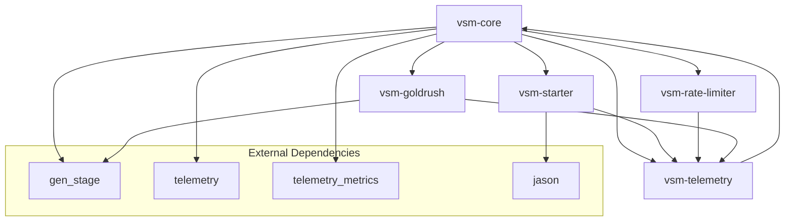
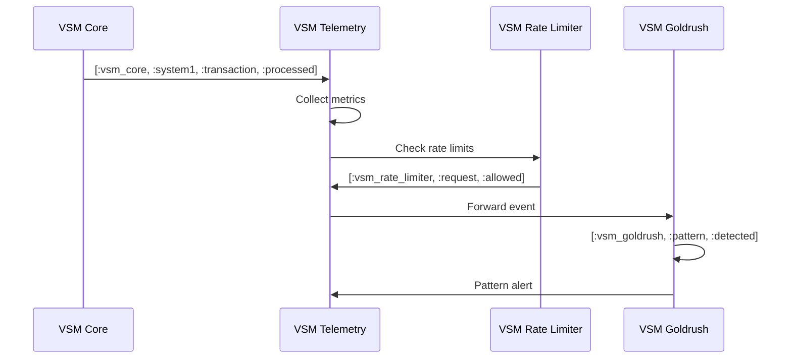

# VSM Ecosystem Compatibility Guide

This guide provides comprehensive compatibility information for all packages in the Viable Systems Model ecosystem.

## Package Compatibility Matrix

| Package | Version | Elixir | OTP | vsm-core | vsm-starter | vsm-telemetry | vsm-rate-limiter | vsm-goldrush |
|---------|---------|--------|-----|----------|-------------|---------------|------------------|--------------|
| **vsm-core** | 0.1.0 | ~> 1.18 | 26+ | ✅ Core | ✅ 0.1.0 | ✅ 0.1.0 | ✅ 0.1.0 | ✅ 0.1.0 |
| **vsm-starter** | 0.1.0 | ~> 1.15 | 25+ | ✅ 0.1.0 | ✅ Core | ✅ 0.1.0 | ✅ 0.1.0 | ✅ 0.1.0 |
| **vsm-telemetry** | 0.1.0 | ~> 1.15 | 25+ | ✅ 0.1.0 | ✅ 0.1.0 | ✅ Core | ✅ 0.1.0 | ✅ 0.1.0 |
| **vsm-rate-limiter** | 0.1.0 | ~> 1.15 | 25+ | ✅ 0.1.0 | ✅ 0.1.0 | ✅ 0.1.0 | ✅ Core | ✅ 0.1.0 |
| **vsm-goldrush** | 0.1.0 | ~> 1.15 | 25+ | ✅ 0.1.0 | ✅ 0.1.0 | ✅ 0.1.0 | ✅ 0.1.0 | ✅ Core |

### Legend
- ✅ **Compatible** - Tested and working
- ⚠️ **Partial** - Some features may not work
- ❌ **Incompatible** - Known issues
- 🔄 **Testing** - Currently being validated

## Dependency Graph



## Integration Patterns

### 1. Full VSM Stack

Complete cybernetic system with all packages:

```elixir
# mix.exs
defp deps do
  [
    {:vsm_core, github: "viable-systems/vsm-core"},
    {:vsm_telemetry, github: "viable-systems/vsm-telemetry"},
    {:vsm_rate_limiter, github: "viable-systems/vsm-rate-limiter"},
    {:vsm_goldrush, github: "viable-systems/vsm-goldrush"}
  ]
end
```

**Boot Order:**
1. VSM Core (foundational subsystems)
2. VSM Telemetry (monitoring)
3. VSM Rate Limiter (protection)
4. VSM Goldrush (pattern detection)

### 2. Minimal VSM System

Basic cybernetic functionality:

```elixir
defp deps do
  [
    {:vsm_core, github: "viable-systems/vsm-core"},
    {:vsm_starter, github: "viable-systems/vsm-starter"}
  ]
end
```

### 3. VSM + Monitoring

Core system with telemetry:

```elixir
defp deps do
  [
    {:vsm_core, github: "viable-systems/vsm-core"},
    {:vsm_telemetry, github: "viable-systems/vsm-telemetry"}
  ]
end
```

### 4. VSM + Protection

Core system with rate limiting:

```elixir
defp deps do
  [
    {:vsm_core, github: "viable-systems/vsm-core"},
    {:vsm_rate_limiter, github: "viable-systems/vsm-rate-limiter"}
  ]
end
```

## Telemetry Event Compatibility

All VSM packages emit compatible telemetry events:

### Event Naming Convention

```
[:vsm, :package_name, :component, :action]
```

### Core Events

```elixir
# VSM Core
[:vsm_core, :system1, :transaction, :processed]
[:vsm_core, :system4, :scan, :completed]
[:vsm_core, :algedonic, :signal, :sent]

# VSM Telemetry (listens to above)
[:vsm_telemetry, :metrics, :collected]
[:vsm_telemetry, :dashboard, :updated]

# VSM Rate Limiter
[:vsm_rate_limiter, :request, :allowed]
[:vsm_rate_limiter, :request, :rejected]
[:vsm_rate_limiter, :algedonic, :alert]

# VSM Goldrush
[:vsm_goldrush, :pattern, :detected]
[:vsm_goldrush, :event, :processed]
```

### Cross-Package Event Flow



## Version Compatibility

### Semantic Versioning

All VSM packages follow [Semantic Versioning](https://semver.org/):

- **MAJOR**: Incompatible API changes
- **MINOR**: Backwards-compatible functionality additions
- **PATCH**: Backwards-compatible bug fixes

### Breaking Changes

#### VSM Core 0.1.0 → 0.2.0 (Planned)
- ⚠️ Message struct format changes
- ⚠️ Channel registration API updates
- ✅ Backwards compatibility layer provided

#### Upgrade Path
```elixir
# Old format (0.1.0)
message = %VSMCore.Shared.Message{
  from: :system1,
  to: :system3,
  type: :command
}

# New format (0.2.0) - with compatibility
message = VSMCore.Shared.Message.new(
  from: :system1,
  to: :system3,
  type: :command
) # Still works with old format via compatibility layer
```

## Configuration Compatibility

### Shared Configuration Keys

All packages respect these configuration keys:

```elixir
# config/config.exs
config :vsm_core,
  telemetry_enabled: true,
  log_level: :info

config :vsm_telemetry,
  enabled: true,
  metrics_interval: :timer.seconds(30),
  dashboard_port: 4000

config :vsm_rate_limiter,
  default_rate_limit: {100, :requests_per_minute},
  telemetry_enabled: true

config :vsm_goldrush,
  pattern_detection: true,
  telemetry_enabled: true
```

### Environment Variables

Standard environment variables across packages:

```bash
# Shared
VSM_LOG_LEVEL=info
VSM_TELEMETRY_ENABLED=true

# Package-specific
VSM_CORE_SYSTEM_COUNT=5
VSM_TELEMETRY_PORT=4000
VSM_RATE_LIMITER_DEFAULT_LIMIT=100
VSM_GOLDRUSH_PATTERN_DETECTION=true
```

## Testing Compatibility

### Compatibility Test Suite

Each package includes compatibility tests:

```elixir
# test/compatibility/
├── vsm_core_compatibility_test.exs
├── vsm_telemetry_compatibility_test.exs
├── vsm_rate_limiter_compatibility_test.exs
└── vsm_goldrush_compatibility_test.exs
```

### Running Compatibility Tests

```bash
# Test all packages together
mix test --only compatibility

# Test specific integration
mix test test/compatibility/vsm_telemetry_compatibility_test.exs

# Test with specific Elixir version
ELIXIR_VERSION=1.18 mix test --only compatibility
```

### Example Compatibility Test

```elixir
defmodule VSMCore.Compatibility.TelemetryTest do
  use ExUnit.Case
  
  @moduletag :compatibility
  
  setup do
    # Start both VSM Core and VSM Telemetry
    {:ok, _} = Application.ensure_all_started(:vsm_core)
    {:ok, _} = Application.ensure_all_started(:vsm_telemetry)
    
    on_exit(fn ->
      Application.stop(:vsm_telemetry)
      Application.stop(:vsm_core)
    end)
    
    :ok
  end
  
  test "telemetry events are compatible" do
    # Attach telemetry handler
    :telemetry.attach(
      "compatibility-test",
      [:vsm_core, :system1, :transaction, :processed],
      &handle_event/4,
      %{test_pid: self()}
    )
    
    # Trigger VSM Core event
    VSMCore.System1.Operations.process_transaction(%{
      type: :test_transaction,
      payload: %{data: "test"}
    })
    
    # Verify VSM Telemetry receives and processes event
    assert_receive {:telemetry_event_received, event_data}, 5_000
    assert event_data.measurements.result == :ok
  end
  
  defp handle_event(_event, measurements, metadata, config) do
    send(config.test_pid, {:telemetry_event_received, %{
      measurements: measurements,
      metadata: metadata
    }})
  end
end
```

## Known Issues and Workarounds

### Issue: Message Validation with vsm-rate-limiter

**Problem**: VSM Core 0.1.0 message validation returns `false` in some cases.

**Workaround**:
```elixir
# Instead of direct validation
message = VSMCore.Shared.Message.command(:s1, :s3, :test, %{})
VSMCore.Shared.Message.valid?(message)  # May return false

# Use helper functions
message = VSMCore.Shared.Message.command(:s1, :s3, :test, %{})
# Message is automatically valid when created with helpers
```

**Status**: Fixed in upcoming 0.1.1 patch

### Issue: Telemetry Event Ordering

**Problem**: High-frequency events may arrive out of order.

**Workaround**:
```elixir
# Include sequence number in metadata
:telemetry.execute(
  [:vsm_core, :system1, :transaction],
  measurements,
  Map.put(metadata, :sequence, System.unique_integer([:monotonic]))
)
```

**Status**: Under investigation

### Issue: Rate Limiter Algedonic Integration

**Problem**: Rate limiter algedonic signals may not reach VSM Core S5.

**Workaround**:
```elixir
# Register custom algedonic handler
VsmRateLimiter.Algedonic.register_handler(fn alert, severity, metadata ->
  if severity in [:critical, :high] do
    # Forward to VSM Core directly
    VSMCore.System1.Operations.send_algedonic_signal(%{
      source: :rate_limiter,
      alert: alert,
      severity: severity,
      metadata: metadata
    })
  end
end)
```

**Status**: Fix planned for 0.1.1

## Migration Guides

### From VSM Core 0.1.0 to 0.1.1

1. **Update dependencies**:
   ```elixir
   {:vsm_core, github: "viable-systems/vsm-core", tag: "v0.1.1"}
   ```

2. **Update message creation** (if using direct struct creation):
   ```elixir
   # Before
   message = %VSMCore.Shared.Message{
     id: UUID.uuid4(),
     timestamp: DateTime.utc_now(),
     # ... other fields
   }
   
   # After
   message = VSMCore.Shared.Message.new(
     from: :system1,
     to: :system3,
     channel: :command_channel,
     type: :test_command,
     payload: %{}
   )
   ```

3. **Test thoroughly**:
   ```bash
   mix test --only compatibility
   ```

### Adding New Packages to Existing VSM System

1. **Check compatibility matrix** above
2. **Add dependency** to mix.exs
3. **Update configuration** as needed
4. **Start in correct order**:
   ```elixir
   # In application.ex
   def start(_type, _args) do
     children = [
       # Core first
       VSMCore.Application,
       
       # Then supporting packages
       VSMTelemetry.Application,
       VSMRateLimiter.Application,
       VSMGoldrush.Application,
       
       # Finally your app
       MyApp.Supervisor
     ]
     
     Supervisor.start_link(children, strategy: :one_for_one)
   end
   ```

## Testing Your Integration

### Comprehensive Integration Test

```elixir
defmodule MyApp.VSMIntegrationTest do
  use ExUnit.Case
  
  setup do
    # Start full VSM stack
    {:ok, _} = Application.ensure_all_started(:vsm_core)
    {:ok, _} = Application.ensure_all_started(:vsm_telemetry)
    {:ok, _} = Application.ensure_all_started(:vsm_rate_limiter)
    {:ok, _} = Application.ensure_all_started(:vsm_goldrush)
    
    # Wait for initialization
    Process.sleep(1000)
    
    :ok
  end
  
  test "full VSM stack integration" do
    # 1. Test VSM Core functionality
    assert VSMCore.health_check() == :ok
    
    # 2. Test telemetry integration
    metrics = VSMTelemetry.get_metrics()
    assert is_map(metrics)
    
    # 3. Test rate limiter integration
    assert {:ok, _} = VsmRateLimiter.check_rate(:s1_environment, "test_user")
    
    # 4. Test pattern detection
    event = %{type: "test", timestamp: DateTime.utc_now()}
    assert :ok = VsmGoldrush.process_event(:test_pattern, event)
    
    # 5. Test cross-package communication
    # Send message that should trigger telemetry, rate limiting, and pattern detection
    message = VSMCore.Shared.Message.command(
      :system1, 
      :system3, 
      :integration_test, 
      %{test: true}
    )
    
    VSMCore.Channels.CommandChannel.send_message(message)
    
    # Wait for processing
    Process.sleep(500)
    
    # Verify all packages processed the event
    updated_metrics = VSMTelemetry.get_metrics()
    assert updated_metrics.command_messages_sent > metrics.command_messages_sent
  end
end
```

### Performance Test

```elixir
defmodule MyApp.VSMPerformanceTest do
  use ExUnit.Case
  
  @tag :performance
  test "VSM stack performance under load" do
    # Start VSM stack
    {:ok, _} = Application.ensure_all_started(:vsm_core)
    {:ok, _} = Application.ensure_all_started(:vsm_telemetry)
    
    # Measure baseline
    start_time = System.monotonic_time(:millisecond)
    
    # Send 1000 messages
    tasks = for i <- 1..1000 do
      Task.async(fn ->
        message = VSMCore.Shared.Message.command(
          :system1,
          :system3,
          :performance_test,
          %{sequence: i}
        )
        
        VSMCore.Channels.CommandChannel.send_message(message)
      end)
    end
    
    # Wait for completion
    Task.await_many(tasks, 30_000)
    
    end_time = System.monotonic_time(:millisecond)
    duration = end_time - start_time
    
    # Assert performance expectations
    assert duration < 10_000  # Should complete in under 10 seconds
    
    # Check system health after load
    assert VSMCore.health_check() == :ok
  end
end
```

## Support and Troubleshooting

### Getting Help

1. **Check compatibility matrix** above
2. **Review known issues** section  
3. **Run compatibility tests**:
   ```bash
   mix test --only compatibility
   ```
4. **Enable debug logging**:
   ```elixir
   config :logger, level: :debug
   ```
5. **Create issue** on relevant GitHub repository

### Debug Information

When reporting compatibility issues, include:

```elixir
# Get system information
VSMCore.system_info()
# Returns: Elixir version, OTP version, package versions, etc.

# Get health status
VSMCore.health_check()
# Returns: :ok | {:error, details}

# Get telemetry summary
VSMTelemetry.compatibility_report()
# Returns: Event counts, processing times, errors
```

### Community Resources

- **Documentation**: https://viable-systems.github.io/vsm-docs/
- **GitHub Discussions**: https://github.com/viable-systems/vsm-core/discussions
- **Issue Tracking**: Individual package repositories
- **Discord**: [VSM Community Server](https://discord.gg/vsm-community)

---

This compatibility guide is updated with each release. For the latest information, see the [online documentation](https://viable-systems.github.io/vsm-docs/guides/compatibility/).