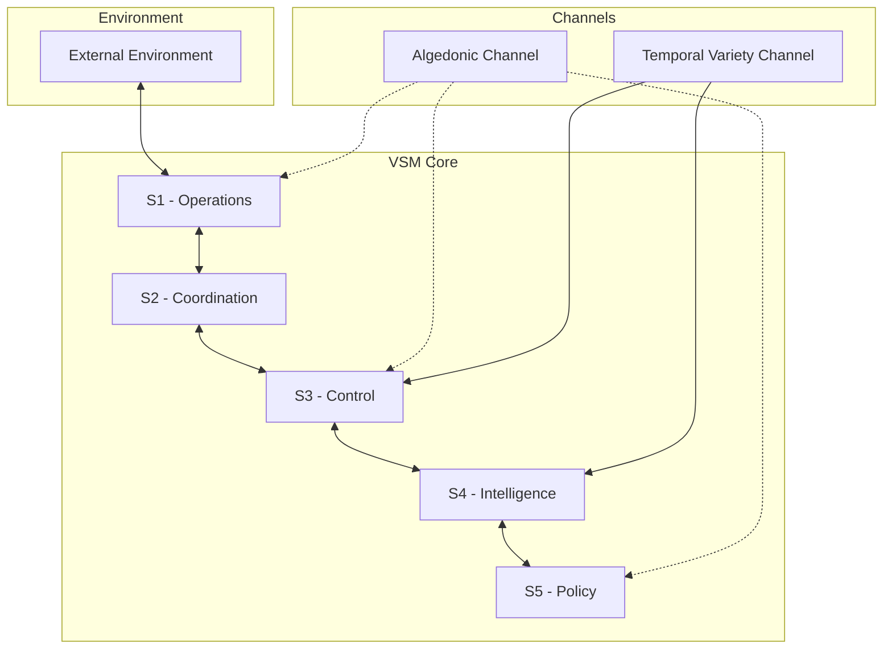

# Viable Systems Model Documentation

Welcome to the comprehensive documentation for the Viable Systems Model (VSM) implementation in Elixir.

## What is VSM?

The Viable Systems Model, developed by Stafford Beer, is a model of the organizational structure of any autonomous system capable of producing itself. It provides a framework for understanding how systems maintain their identity and purpose while adapting to environmental changes.

## Key Features of Our Implementation

- **Complete VSM Implementation**: All five subsystems (S1-S5) fully implemented in Elixir
- **Algedonic Channel**: Real-time alerting system for critical signals
- **Temporal Variety Channel**: Our novel contribution to cybernetics (1,368 lines of innovative code)
- **Z3N Security Architecture**: Zero-trust, zero-knowledge, zero-latency security
- **OTP Integration**: Built on Elixir's robust OTP principles
- **Phoenix LiveView**: Real-time UI for system monitoring and control

## Quick Navigation

-   :material-rocket-launch:{ .lg .middle } **Getting Started**

    ---

    New to VSM? Start here with installation and your first VSM system.

    [:octicons-arrow-right-24: Getting Started](getting-started/index.md)

-   :material-book-open-variant:{ .lg .middle } **Core Concepts**

    ---

    Understand the fundamental principles of VSM and cybernetics.

    [:octicons-arrow-right-24: Overview](overview/index.md)

-   :material-cube-outline:{ .lg .middle } **Subsystems**

    ---

    Deep dive into each VSM subsystem (S1-S5) and support channels.

    [:octicons-arrow-right-24: Subsystems](subsystems/index.md)

-   :material-road-variant:{ .lg .middle } **Migration Roadmap**

    ---

    Follow our 16-week roadmap to build a complete VSM system.

    [:octicons-arrow-right-24: Roadmap](roadmap/index.md)

## Why Choose Our VSM Implementation?

### 1. **Built on Elixir/OTP**
- Fault-tolerant by design
- Massive concurrency support
- Hot code reloading
- Built-in distribution

### 2. **Modern Architecture**
- Microservices-ready
- Event-driven design
- CQRS/Event Sourcing patterns
- GraphQL and REST APIs

### 3. **Production-Ready**
- Comprehensive test suite
- Performance benchmarks
- Monitoring and observability
- Security-first design

### 4. **Innovation**
- Temporal Variety Channel for handling time-based complexity
- Advanced pattern recognition in S4
- Quantum-resistant security considerations
- AI/ML integration points

## System Architecture Overview

## Getting Help

- **GitHub Issues**: [Report bugs or request features](https://github.com/viable-systems/vsm-core/issues)
- **Discussions**: [Join the community](https://github.com/viable-systems/vsm-core/discussions)
- **Stack Overflow**: Tag questions with `vsm-elixir`

## Latest Updates

!!! tip "Version 0.1.0 Released"
    The first alpha release of VSM Core is now available! This release includes basic implementations of all five subsystems and the Algedonic Channel.

!!! info "Roadmap Published"
    Our comprehensive 16-week migration roadmap is now available, detailing the path from monolithic to fully modular VSM implementation.

## Next Steps

1. [Install VSM Core](getting-started/installation.md)
2. [Build Your First System](getting-started/first-system.md)
3. [Explore the Examples](getting-started/examples.md)
4. [Join the Community](https://github.com/viable-systems/vsm-core/discussions)

---

*"The purpose of a system is what it does."* - Stafford Beer