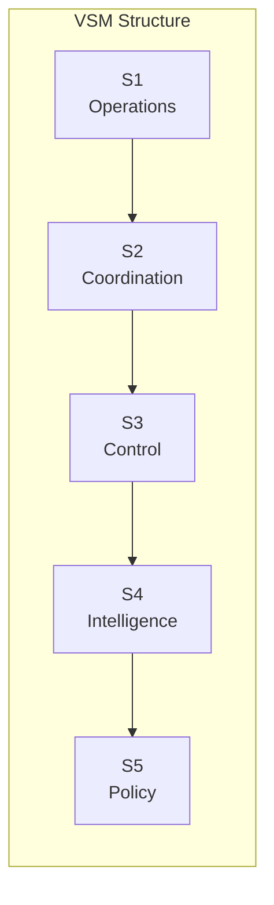

# Overview

The Viable Systems Model (VSM) is a powerful framework for designing and managing complex adaptive systems. This section provides a comprehensive introduction to VSM concepts and our Elixir implementation.

## In This Section

- **[What is VSM?](what-is-vsm.md)** - Introduction to the Viable Systems Model and its history
- **[Why VSM?](why-vsm.md)** - Benefits and use cases for VSM in modern systems
- **[Key Concepts](key-concepts.md)** - Essential VSM terminology and principles
- **[Architecture](architecture.md)** - High-level architecture of our Elixir implementation

## Core Principles

The VSM is built on several key cybernetic principles:

### 1. **Recursion**
Every viable system contains and is contained by other viable systems. This fractal nature allows VSM to model organizations at any scale.

### 2. **Autonomy**
Each subsystem maintains its own management while contributing to the whole. This balance between autonomy and cohesion is critical.

### 3. **Viability**
A system is viable if it can maintain its identity and purpose in a changing environment. VSM provides the structure for this adaptability.

### 4. **Variety Engineering**
Managing the complexity (variety) flowing through the system using amplifiers and attenuators. This is central to VSM's approach to control.

## The Five Subsystems

### Quick Overview:

- **S1 (Operations)**: The primary activities that define the system's purpose
- **S2 (Coordination)**: Prevents oscillation between operational units
- **S3 (Control)**: Day-to-day management and resource allocation
- **S4 (Intelligence)**: Environmental scanning and adaptation
- **S5 (Policy)**: Ultimate authority and identity maintenance

## Our Implementation Approach

Our Elixir implementation leverages the language's strengths:

### Concurrency Model
- Each subsystem runs as independent OTP processes
- Message passing ensures loose coupling
- Supervision trees provide fault tolerance

### Event-Driven Architecture
- All state changes emit events
- Event sourcing for audit and replay
- CQRS for read/write optimization

### Distribution Ready
- Designed for clustering from day one
- Location transparency for subsystems
- Network partition tolerance

## Unique Innovations

### Temporal Variety Channel
Our novel contribution to VSM theory - a channel that handles time-based complexity:

- Processes historical patterns
- Predicts future variety requirements
- Adjusts system parameters dynamically

### Z3N Security Architecture
Zero-trust, zero-knowledge, zero-latency security:

- Every message authenticated
- No implicit trust relationships
- Minimal performance overhead

### Phoenix LiveView Integration
Real-time system visualization and control:

- Live system dashboards
- Interactive variety management
- Real-time alerting

## Getting Started

Ready to dive deeper? Here's your learning path:

1. **Understand the Theory**: Read [What is VSM?](what-is-vsm.md)
2. **Learn the Benefits**: Explore [Why VSM?](why-vsm.md)
3. **Master the Concepts**: Study [Key Concepts](key-concepts.md)
4. **Explore the Architecture**: Review [Architecture](architecture.md)

Or jump straight to [Getting Started](../getting-started/index.md) to begin building!

## Resources

### Books
- "Brain of the Firm" by Stafford Beer
- "The Heart of Enterprise" by Stafford Beer
- "Diagnosing the System" by Stafford Beer

### Papers
- "The Viable System Model: Its Provenance, Development, Methodology and Pathology"
- "Thirty Years of the Viable System Model"

### Online Resources
- [Metaphorum Society](http://www.metaphorum.org/)
- [VSM Wiki](http://www.vsmwiki.org/)

---

*Next: [What is VSM?](what-is-vsm.md) →*