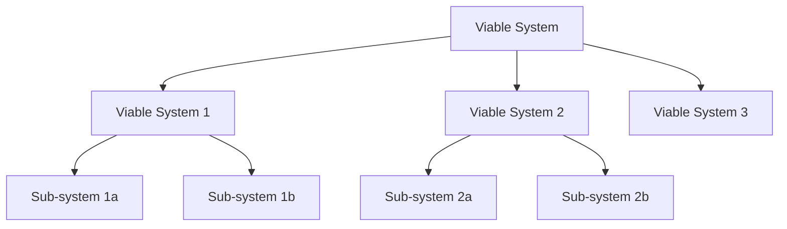

# What is VSM?

The Viable Systems Model (VSM) is a model of the organizational structure of any autonomous system capable of producing itself. Developed by operations research theorist and cybernetician Stafford Beer in the 1970s, VSM provides a framework for understanding how systems can remain viable in changing environments.

## Origins and History

### The Cybernetic Foundation

Stafford Beer developed VSM as part of his work in management cybernetics, drawing on:

- **Cybernetics**: The science of communication and control in systems
- **Neurophysiology**: How the human nervous system maintains homeostasis
- **Operations Research**: Mathematical methods for complex decision-making
- **Systems Theory**: Understanding wholes rather than parts

### Project Cybersyn

VSM gained prominence through Project Cybersyn in Chile (1971-1973), where Beer attempted to apply cybernetic principles to manage the entire Chilean economy. Though the project was cut short, it demonstrated VSM's potential for managing complex systems.

## Core Concepts

### Viability

A system is viable if it can:
1. Maintain its identity over time
2. Respond to environmental changes
3. Achieve its purpose effectively
4. Survive disruptions and threats

### Recursive Structure

VSM's key insight is that viable systems have a recursive structure:



Each level contains the same essential structure, like Russian dolls or fractals.

### The Five Subsystems

Every viable system requires five functional subsystems:

1. **System 1 (Operations)**: Primary activities that produce the system's products or services
2. **System 2 (Coordination)**: Prevents conflict between operational units
3. **System 3 (Control)**: Manages current operations and resource allocation
4. **System 4 (Intelligence)**: Looks outward and forward, planning for the future
5. **System 5 (Policy)**: Provides identity and ultimate authority

### Communication Channels

VSM includes several communication channels:

- **Command Channel**: Hierarchical instructions
- **Resource Bargaining**: Negotiation for resources
- **Algedonic Channel**: Emergency alerts (pain/pleasure signals)
- **Environmental Channel**: Information from outside

## Why VSM Matters Today

### Complexity Management

Modern organizations face unprecedented complexity:
- Global supply chains
- Rapid technological change
- Distributed teams
- Real-time decision needs

VSM provides a proven framework for managing this complexity.

### Digital Transformation

VSM principles align perfectly with modern technology:
- Microservices mirror VSM's modular structure
- Event-driven architecture matches VSM's communication patterns
- Distributed systems benefit from VSM's autonomy principles
- AI/ML can enhance S4's intelligence functions

### Resilience and Adaptability

In an uncertain world, VSM offers:
- Built-in feedback loops
- Distributed decision-making
- Rapid response to changes
- Systemic resilience

## VSM vs Traditional Models

### Hierarchical Organizations

Traditional hierarchy:
```
CEO → VPs → Directors → Managers → Workers
```

VSM approach:
```
Policy (S5) ← Intelligence (S4)
     ↓                ↓
Control (S3) ← Coordination (S2)
     ↓                ↓
        Operations (S1)
```

### Key Differences

| Aspect | Traditional | VSM |
|--------|------------|-----|
| Structure | Rigid hierarchy | Recursive, flexible |
| Communication | Top-down | Multi-directional |
| Decision-making | Centralized | Distributed |
| Adaptation | Slow | Rapid |
| Focus | Control | Viability |

## Real-World Applications

### Business Organizations
- Corporate management structures
- Supply chain coordination
- Strategic planning systems
- Risk management frameworks

### Government Services
- Smart city management
- Healthcare system coordination
- Emergency response systems
- Public service delivery

### Technology Systems
- Distributed computing architectures
- IoT network management
- Autonomous vehicle fleets
- Cloud infrastructure

### Ecological Systems
- Environmental monitoring
- Resource management
- Sustainability planning
- Climate adaptation

## Our Implementation

Our Elixir implementation brings VSM into the modern era with:

### Technical Innovations
- **Actor Model**: Each subsystem as independent processes
- **Event Sourcing**: Complete audit trail of all decisions
- **Real-time Processing**: Immediate response to environmental changes
- **Distributed Architecture**: Scale across multiple nodes

### Novel Contributions
- **Temporal Variety Channel**: Handles time-based complexity
- **Z3N Security**: Zero-trust architecture throughout
- **Phoenix LiveView**: Real-time visualization
- **GraphQL API**: Modern integration capabilities

## Getting Started with VSM

### For Theorists
1. Read Beer's original works
2. Study cybernetic principles
3. Understand variety engineering
4. Explore recursive structures

### For Practitioners
1. Identify your system boundaries
2. Map current operations to S1
3. Identify coordination needs (S2)
4. Define control mechanisms (S3)
5. Establish intelligence gathering (S4)
6. Clarify identity and purpose (S5)

### For Developers
1. Install our VSM implementation
2. Run example systems
3. Build custom subsystems
4. Integrate with existing infrastructure

## Key Principles to Remember

1. **Purpose Defines Structure**: "The purpose of a system is what it does"
2. **Requisite Variety**: Control variety must match environmental variety
3. **Recursive Viability**: Each part must be viable for the whole to be viable
4. **Autonomy within Cohesion**: Balance independence with integration
5. **Continuous Adaptation**: Viability requires constant adjustment

## Further Reading

### Essential Books
- "Brain of the Firm" - Stafford Beer
- "The Heart of Enterprise" - Stafford Beer
- "Platform for Change" - Stafford Beer

### Academic Papers
- "The Viable System Model: Its Provenance, Development, Methodology and Pathology" - Stafford Beer
- "Thirty Years of the Viable Systems Model" - Multiple authors

### Online Resources
- [Metaphorum Society](http://www.metaphorum.org/)
- [VSM Guide](http://www.vsmg.co.uk/)
- [Cybernetics Society](http://www.cybsoc.org/)

## Next Steps

Now that you understand what VSM is, explore:

1. [Why use VSM?](why-vsm.md) - Benefits and use cases
2. [Key Concepts](key-concepts.md) - Deep dive into VSM terminology
3. [Architecture](architecture.md) - How our implementation works
4. [Getting Started](../getting-started/index.md) - Build your first system

---

*"The purpose of a system is what it does."* - Stafford Beer