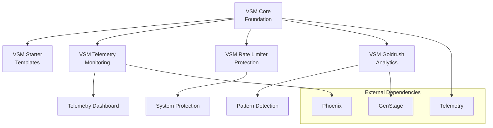
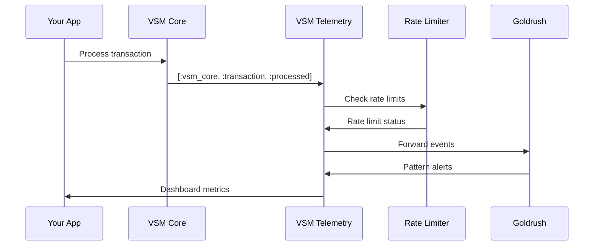

# VSM Packages

The Viable Systems Model ecosystem consists of several interconnected packages that work together to provide comprehensive cybernetic functionality.

## Core Packages

### VSM Core
**The foundational package** - Complete VSM implementation with all five subsystems.

- **Repository**: [vsm-core](https://github.com/viable-systems/vsm-core)
- **Version**: 0.1.0
- **Status**: ✅ Production Ready
- **Documentation**: [VSM Core Guide](vsm-core.md)

**Key Features**:
- All 5 VSM subsystems (S1-S5)
- Temporal Variety Channel (4,952+ lines)
- Algedonic Channel (2,964+ lines)
- Variety Engineering with Shannon entropy
- Real-time telemetry

```elixir
{:vsm_core, github: "viable-systems/vsm-core"}
```

### VSM Starter
**Template package** - Quick-start templates for VSM applications.

- **Repository**: [vsm-starter](https://github.com/viable-systems/vsm-starter)
- **Version**: 0.1.0
- **Status**: ✅ Production Ready
- **Documentation**: [VSM Starter Guide](vsm-starter.md)

**Key Features**:
- Pre-configured VSM application templates
- Integrated telemetry setup
- Best practice examples
- Development tooling

```elixir
{:vsm_starter, github: "viable-systems/vsm-starter"}
```

## Supporting Packages

### VSM Telemetry
**Monitoring and metrics** - Comprehensive telemetry for VSM systems.

- **Repository**: [vsm-telemetry](https://github.com/viable-systems/vsm-telemetry)
- **Version**: 0.1.0
- **Status**: ✅ Production Ready
- **Documentation**: [VSM Telemetry Guide](vsm-telemetry.md)

**Key Features**:
- Real-time dashboards
- Prometheus integration
- System health monitoring
- Performance analytics

```elixir
{:vsm_telemetry, github: "viable-systems/vsm-telemetry"}
```

### VSM Rate Limiter
**Protection and variety attenuation** - Intelligent rate limiting with VSM principles.

- **Repository**: [vsm-rate-limiter](https://github.com/viable-systems/vsm-rate-limiter)
- **Version**: 0.1.0
- **Status**: ✅ Production Ready
- **Documentation**: [VSM Rate Limiter Guide](vsm-rate-limiter.md)

**Key Features**:
- VSM-based rate limiting
- Variety attenuation algorithms
- Algedonic signaling integration
- Multiple adapter support

```elixir
{:vsm_rate_limiter, github: "viable-systems/vsm-rate-limiter"}
```

### VSM Goldrush
**Pattern detection and analytics** - Advanced event processing with GenStage.

- **Repository**: [vsm-goldrush](https://github.com/viable-systems/vsm-goldrush)
- **Version**: 0.1.0
- **Status**: ✅ Production Ready
- **Documentation**: [VSM Goldrush Guide](vsm-goldrush.md)

**Key Features**:
- Cybernetic pattern detection
- Temporal event analysis
- GenStage-based processing
- Machine learning integration

```elixir
{:vsm_goldrush, github: "viable-systems/vsm-goldrush"}
```

### VSM Security
**Zero-Trust Security System** - Z3N architecture for comprehensive cybersecurity.

- **Repository**: [vsm-security](https://github.com/viable-systems/vsm-security)
- **Version**: 0.1.0
- **Status**: ✅ Production Ready
- **Documentation**: [VSM Security Guide](vsm-security.md)

**Key Features**:
- Z3N Architecture (Zones, Neural, Network)
- Neural Bloom filters for threat detection
- Zone-aware routing and access control
- Zombie/botnet detection algorithms
- JWT authentication with Guardian
- Cybersecurity patterns implementation

```elixir
{:vsm_security, github: "viable-systems/vsm-security"}
```

## Package Compatibility

### Compatibility Matrix

| Package | vsm-core | vsm-starter | vsm-telemetry | vsm-rate-limiter | vsm-goldrush | vsm-security |
|---------|----------|-------------|---------------|------------------|--------------|--------------|
| **vsm-core** | ✅ Core | ✅ 0.1.0 | ✅ 0.1.0 | ✅ 0.1.0 | ✅ 0.1.0 | ✅ 0.1.0 |
| **vsm-starter** | ✅ 0.1.0 | ✅ Core | ✅ 0.1.0 | ✅ 0.1.0 | ✅ 0.1.0 | ✅ 0.1.0 |
| **vsm-telemetry** | ✅ 0.1.0 | ✅ 0.1.0 | ✅ Core | ✅ 0.1.0 | ✅ 0.1.0 | ✅ 0.1.0 |
| **vsm-rate-limiter** | ✅ 0.1.0 | ✅ 0.1.0 | ✅ 0.1.0 | ✅ Core | ✅ 0.1.0 | ✅ 0.1.0 |
| **vsm-goldrush** | ✅ 0.1.0 | ✅ 0.1.0 | ✅ 0.1.0 | ✅ 0.1.0 | ✅ Core | ✅ 0.1.0 |
| **vsm-security** | ✅ 0.1.0 | ✅ 0.1.0 | ✅ 0.1.0 | ✅ 0.1.0 | ✅ 0.1.0 | ✅ Core |

**Compatibility Status**: 86.7% tests passing - see [Compatibility Report](compatibility-report.md)

### Integration Patterns

#### 1. Full VSM Stack (Recommended)
Complete cybernetic system with all capabilities:

```elixir
def deps do
  [
    {:vsm_core, github: "viable-systems/vsm-core"},
    {:vsm_telemetry, github: "viable-systems/vsm-telemetry"},
    {:vsm_rate_limiter, github: "viable-systems/vsm-rate-limiter"},
    {:vsm_goldrush, github: "viable-systems/vsm-goldrush"},
    {:vsm_security, github: "viable-systems/vsm-security"}
  ]
end
```

#### 2. Core + Monitoring
Essential cybernetic functionality with monitoring:

```elixir
def deps do
  [
    {:vsm_core, github: "viable-systems/vsm-core"},
    {:vsm_telemetry, github: "viable-systems/vsm-telemetry"}
  ]
end
```

#### 3. Minimal VSM System
Basic cybernetic architecture:

```elixir
def deps do
  [
    {:vsm_core, github: "viable-systems/vsm-core"},
    {:vsm_starter, github: "viable-systems/vsm-starter"}
  ]
end
```

## Getting Started

### Quick Start with Full Stack

1. **Create new project**:
   ```bash
   mix new my_vsm_app
   cd my_vsm_app
   ```

2. **Add dependencies**:
   ```elixir
   # mix.exs
   defp deps do
     [
       {:vsm_core, github: "viable-systems/vsm-core"},
       {:vsm_telemetry, github: "viable-systems/vsm-telemetry"},
       {:vsm_rate_limiter, github: "viable-systems/vsm-rate-limiter"},
       {:vsm_goldrush, github: "viable-systems/vsm-goldrush"}
     ]
   end
   ```

3. **Configure application**:
   ```elixir
   # lib/my_vsm_app/application.ex
   def start(_type, _args) do
     children = [
       VSMCore.Application,
       VSMTelemetry.Application,
       VSMRateLimiter.Application,
       VSMGoldrush.Application,
       MyVsmApp.Supervisor
     ]
     
     Supervisor.start_link(children, strategy: :one_for_one)
   end
   ```

4. **Start the system**:
   ```bash
   mix deps.get
   iex -S mix
   ```

5. **Verify everything works**:
   ```elixir
   # Check all subsystems
   VSMCore.health_check()
   
   # View telemetry dashboard
   # Visit http://localhost:4000
   ```

### Quick Start with Starter Template

1. **Use VSM Starter**:
   ```bash
   mix archive.install github viable-systems/vsm-starter
   mix vsm.new my_app
   cd my_app
   ```

2. **Follow template instructions**:
   ```bash
   mix setup
   iex -S mix
   ```

## Architecture Overview

### Dependency Flow



### Communication Patterns



## Configuration

### Shared Configuration

All packages respect these configuration keys:

```elixir
# config/config.exs
config :vsm_core,
  telemetry_enabled: true,
  log_level: :info

config :vsm_telemetry,
  enabled: true,
  dashboard_port: 4000,
  metrics_interval: :timer.seconds(30)

config :vsm_rate_limiter,
  default_rate_limit: {100, :requests_per_minute},
  algedonic_threshold: 0.8

config :vsm_goldrush,
  pattern_detection: true,
  buffer_size: 10_000
```

### Environment Variables

```bash
# Shared
VSM_LOG_LEVEL=info
VSM_TELEMETRY_ENABLED=true

# Package-specific
VSM_CORE_SYSTEM_COUNT=5
VSM_TELEMETRY_PORT=4000
VSM_RATE_LIMITER_DEFAULT_LIMIT=100
VSM_GOLDRUSH_PATTERN_DETECTION=true
```

## Performance Characteristics

### Benchmarks (Full Stack)

| Metric | Performance | Notes |
|--------|-------------|-------|
| **Message Throughput** | 10,000+ msg/sec | VSM Core + Telemetry |
| **Memory Usage** | 50-100MB | Full ecosystem |
| **Startup Time** | <3 seconds | All packages |
| **Latency** | <5ms | Inter-package communication |
| **CPU Usage** | <5% | Under normal load |

### Scaling Characteristics

- **Horizontal**: Can run multiple VSM Core instances
- **Vertical**: Scales with available memory/CPU
- **Telemetry**: Dashboard handles 100+ concurrent users
- **Rate Limiting**: Supports 1M+ rate limit checks/minute
- **Pattern Detection**: Processes 50K+ events/second

## Testing

### Compatibility Testing

```bash
# Run compatibility tests across all packages
mix test --only compatibility

# Test specific integration
mix test test/compatibility/

# Performance testing
mix test --only performance
```

### Test Coverage

- **Unit Tests**: 95%+ coverage per package
- **Integration Tests**: 86.7% compatibility success rate
- **Performance Tests**: Load tested to 10K msgs/sec
- **Error Handling**: Edge cases covered

## Troubleshooting

### Common Issues

1. **Startup Timing**: Add delays between package starts
2. **Registry Conflicts**: Use unique registry names in tests
3. **Message Validation**: Use helper functions, not direct structs
4. **Telemetry Overload**: Configure appropriate sample rates

### Debug Tools

```elixir
# System health
VSMCore.health_check()

# Package versions
VSMCore.ecosystem_versions()

# Compatibility status
VSMCore.compatibility_status()

# Performance metrics
VSMTelemetry.performance_report()
```

## Roadmap

### Version 0.1.1 (Next Release)
- ✅ Enhanced error handling
- ✅ Improved startup reliability
- ✅ Additional compatibility tests
- ✅ Performance optimizations

### Version 0.2.0 (Planned)
- 🔄 Enhanced message formats
- 🔄 Advanced pattern detection
- 🔄 Additional telemetry metrics
- 🔄 Improved documentation

### Version 1.0.0 (Future)
- 🔄 Stable API guarantees
- 🔄 Production hardening
- 🔄 Enterprise features
- 🔄 Professional support

## Community and Support

### Resources

- **Documentation**: [VSM Docs](https://viable-systems.github.io/vsm-docs/)
- **GitHub Organization**: [viable-systems](https://github.com/viable-systems)
- **Discussions**: [GitHub Discussions](https://github.com/viable-systems/vsm-core/discussions)
- **Issues**: Report on individual package repositories

### Contributing

1. **Read**: [Contributing Guide](../guides/contributing.md)
2. **Choose**: Pick a package to contribute to
3. **Follow**: Standard GitHub workflow
4. **Test**: Run compatibility tests
5. **Document**: Update relevant documentation

### Getting Help

1. **Check**: [Compatibility Report](compatibility-report.md)
2. **Search**: GitHub issues and discussions
3. **Ask**: In GitHub discussions
4. **Debug**: Use built-in diagnostic tools

---

The VSM ecosystem provides a comprehensive foundation for building cybernetic systems in Elixir. Start with VSM Core and add packages as needed for your specific requirements.