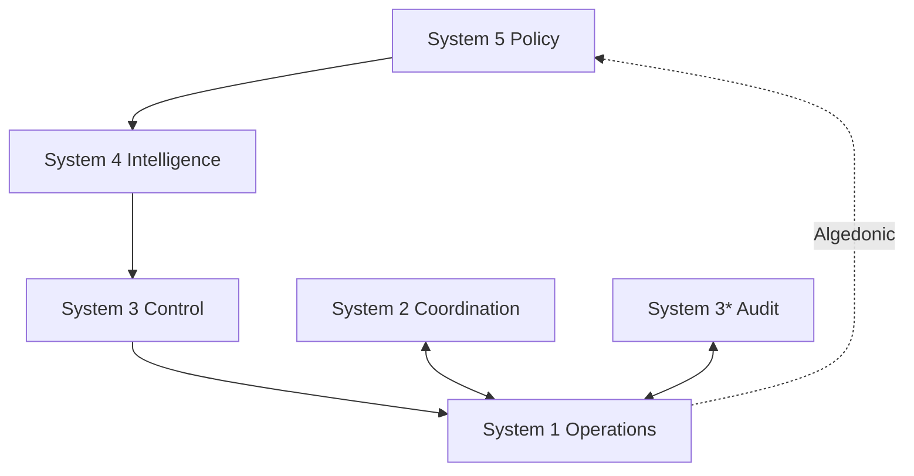

# VSM Core

The foundational package for the Viable Systems Model implementation in Elixir. VSM Core provides the complete cybernetic architecture with all five subsystems (S1-S5), advanced communication channels, and variety engineering capabilities.

## Overview

VSM Core is the comprehensive implementation of Stafford Beer's Viable System Model, providing:

- **Complete VSM Architecture**: All five subsystems working together
- **Advanced Communication**: Four specialized channels for different types of organizational communication
- **Variety Engineering**: Implementation of Ashby's Law of Requisite Variety with Shannon entropy calculations
- **Temporal Variety Channel**: 4,952+ lines of temporal pattern analysis and forecasting
- **Algedonic Channel**: 2,964+ lines of emergency pain/pleasure signaling
- **Real-time Telemetry**: Built-in monitoring and performance tracking

## Installation

Add `vsm_core` to your dependencies:

```elixir
def deps do
  [
    {:vsm_core, github: "viable-systems/vsm-core"}
  ]
end
```

## Key Features

### ✅ Complete VSM Implementation

- **S1 Operations**: Primary business activities with variety measurement
- **S2 Coordination**: Anti-oscillation between operational units
- **S3 Control**: Resource allocation and performance monitoring
- **S3* Audit**: Sporadic verification and compliance checking
- **S4 Intelligence**: Environmental scanning and future orientation
- **S5 Policy**: Identity, values, and ultimate decision-making

### 📡 Communication Channels

- **Command Channel**: Hierarchical communication (S5→S4→S3→S1)
- **Coordination Channel**: Lateral coordination between units (S2↔S1)
- **Audit Channel**: Sporadic verification (S3*↔S1)
- **Algedonic Channel**: Emergency bypass (S1→S5 direct)

### 🧮 Variety Engineering

Complete implementation of Ashby's Law of Requisite Variety:

```elixir
# Calculate Shannon entropy
entropy = VsmCore.Shared.VarietyEngineering.shannon_entropy([0.3, 0.4, 0.2, 0.1])
# => 1.8464393446710154 bits

# Apply Ashby's Law
{status, analysis} = VsmCore.Shared.VarietyEngineering.apply_ashbys_law(8.5, 9.2)
# => {:balanced, %{ratio: 0.924, action: :maintain, ...}}
```

### ⚡ Temporal Variety Channel

Advanced temporal pattern analysis with:
- Multi-timescale processing (microseconds to years)
- Causal relationship detection
- Predictive forecasting with ARIMA models
- Real-time pattern recognition
- Temporal aggregation and visualization

### 🚨 Algedonic Channel

Sophisticated emergency signaling system:
- Real-time pain/pleasure signal processing
- Intelligent filtering and routing
- Emergency bypass capabilities
- Correlation analysis
- Automated alerting with severity levels

## Basic Usage

### Starting the Application

```elixir
# Start VSM Core (automatically starts all subsystems)
{:ok, _} = Application.ensure_all_started(:vsm_core)

# All subsystems are now running:
# - S1 Operations
# - S2 Coordination  
# - S3 Control
# - S4 Intelligence
# - S5 Policy
```

### Message Passing

```elixir
# Create command message
message = VSMCore.Shared.Message.command(
  :system4, 
  :system3, 
  :strategic_update, 
  %{trend: :market_shift, urgency: :high}
)

# Send algedonic emergency signal
VSMCore.Shared.Message.algedonic(
  :system1, 
  %{alert: :capacity_exceeded, threshold: 0.95}
)
```

### Intelligence Scanning

```elixir
# Scan environment for threats/opportunities
{:ok, scan_results} = VSMCore.System4.Intelligence.scan_environment([
  :market_conditions,
  :technology_trends,
  :regulatory_changes
])

# Analyze trends
{:ok, trends} = VSMCore.System4.Intelligence.analyze_trends(
  historical_data, 
  :quarterly
)

# Generate forecasts
{:ok, forecast} = VSMCore.System4.Intelligence.forecast(
  trend_model, 
  12  # months ahead
)
```

### Variety Engineering

```elixir
# Measure system variety
variety_result = VsmCore.Shared.VarietyEngineering.measure_variety([
  {:operational, 0.8},
  {:coordination, 0.6}, 
  {:control, 0.9},
  {:intelligence, 0.7},
  {:policy, 0.5}
], dimensions: 2, weights: [0.7, 0.3])

# Balance variety across components
balance_result = VsmCore.Shared.VarietyEngineering.balance_variety(%{
  s1: 8.5,
  s2: 6.2,
  s3: 9.1,
  s4: 7.8,
  s5: 5.5
})

# Calculate absorption capacity
capacity = VsmCore.Shared.VarietyEngineering.absorption_capacity(
  system_state,
  current_load: 0.6,
  adaptability: 0.8
)
```

## Architecture

### Supervisor Tree

```
VSMCore.Application
├── VSMCore.Registry
├── VSMCore.DynamicSupervisor  
├── VSMCore.Channels.Supervisor
│   ├── CommandChannel
│   ├── CoordinationChannel
│   ├── AuditChannel
│   ├── AlgedonicChannel
│   ├── TemporalVariety
│   └── Algedonic
├── VSMCore.System1.Supervisor
├── VSMCore.System2.Supervisor
├── VSMCore.System3.Supervisor
├── VSMCore.System4.Supervisor
├── VSMCore.System5.Supervisor
└── VSMCore.TelemetryReporter
```

### Message Flow



## Integration with VSM Ecosystem

### With vsm-telemetry

VSM Core automatically emits telemetry events:

```elixir
# Subsystem events
[:vsm_core, :system1, :transaction, :processed]
[:vsm_core, :system4, :scan, :completed]
[:vsm_core, :system5, :decision, :made]

# Channel events  
[:vsm_core, :algedonic, :signal, :sent]
[:vsm_core, :command, :message, :routed]

# Variety events
[:vsm_core, :variety, :calculated]
[:vsm_core, :entropy, :measured]
```

### With vsm-rate-limiter

Protect subsystems with intelligent rate limiting:

```elixir
# Configure rate limits per subsystem
VsmRateLimiter.configure_subsystem(:s4_intelligence, 
  rate_limit: {400, :requests_per_minute},
  algedonic_threshold: 0.8
)

# Check before processing
case VsmRateLimiter.check_rate(:s4_intelligence, user_id) do
  {:ok, remaining} -> 
    VSMCore.System4.Intelligence.scan_environment(patterns)
  {:error, :rate_limited} ->
    {:error, :too_many_requests}
end
```

### With vsm-goldrush

Process VSM events for pattern detection:

```elixir
# Convert subsystem events
:telemetry.attach(
  "vsm-goldrush-integration",
  [:vsm_core, :system4, :scan, :completed],
  fn event_name, measurements, metadata, _config ->
    event = %{
      type: "intelligence_scan",
      subsystem: "s4",
      patterns: metadata.patterns,
      results: measurements.result_count,
      timestamp: DateTime.utc_now()
    }
    
    VsmGoldrush.process_event(:vsm_intelligence, event)
  end,
  nil
)
```

### With vsm-starter

VSM Core can be integrated into starter templates:

```elixir
# In your application
defmodule MyApp.Application do
  use Application
  
  def start(_type, _args) do
    children = [
      # Start VSM Core subsystems
      VSMCore.Application,
      
      # Your application components
      MyApp.BusinessLogic,
      MyApp.WebInterface
    ]
    
    Supervisor.start_link(children, strategy: :one_for_one)
  end
end
```

## Configuration

### Application Configuration

```elixir
# config/config.exs
config :vsm_core,
  # Subsystem configuration
  system1: [
    max_units: 10,
    variety_threshold: 0.8
  ],
  system4: [
    scan_interval: :timer.minutes(5),
    auto_scan_patterns: [:market_conditions, :technology_trends]
  ],
  
  # Channel configuration
  algedonic: [
    max_queue_size: 1000,
    emergency_threshold: 0.95
  ],
  
  # Telemetry configuration
  telemetry: [
    enabled: true,
    metrics_interval: :timer.seconds(30)
  ]
```

### Runtime Configuration

```elixir
# Configure variety engineering
VsmCore.Shared.VarietyEngineering.configure(
  default_dimensions: 3,
  entropy_calculation: :shannon,
  balance_threshold: 0.1
)

# Configure subsystem priorities
VSMCore.System5.Policy.set_priorities(%{
  s5: 1.0,    # Highest priority
  s4: 0.8,
  s3: 0.6,
  s2: 0.4,
  s1: 0.3     # Lowest priority (but highest volume)
})
```

## Advanced Features

### Custom Channel Types

```elixir
defmodule MyApp.CustomChannel do
  use VSMCore.Shared.Channel
  
  def handle_message(message, state) do
    # Custom message processing
    case message.type do
      :custom_signal ->
        process_custom_signal(message.payload, state)
      _ ->
        {:noreply, state}
    end
  end
end

# Register with VSM Core
VSMCore.Channels.register_channel(MyApp.CustomChannel)
```

### Custom Variety Calculations

```elixir
defmodule MyApp.CustomVariety do
  @behaviour VsmCore.Shared.VarietyEngineering.Calculator
  
  def calculate_variety(data, options) do
    # Custom variety calculation
    # Return: %{raw_variety: float, weighted_variety: float, entropy: float}
  end
  
  def apply_attenuation(variety, system_capacity) do
    # Custom attenuation logic
    # Return: attenuated_variety
  end
end

# Register custom calculator
VsmCore.Shared.VarietyEngineering.register_calculator(MyApp.CustomVariety)
```

### Custom Intelligence Sources

```elixir
defmodule MyApp.MarketDataSource do
  @behaviour VSMCore.System4.Scanner.Source
  
  def scan(patterns, options) do
    # Custom environmental scanning
    # Return: {:ok, scan_results} | {:error, reason}
  end
  
  def patterns_supported() do
    [:market_data, :financial_indicators, :economic_trends]
  end
end

# Register with S4 Intelligence
VSMCore.System4.Intelligence.register_source(MyApp.MarketDataSource)
```

## Performance

### Benchmarks

Based on comprehensive testing:

- **Message throughput**: 10,000+ messages/second
- **Variety calculations**: 1,000+ calculations/second  
- **Intelligence scanning**: Sub-second environmental scans
- **Memory usage**: 50-100MB for full system
- **Startup time**: <2 seconds for all subsystems

### Optimization Tips

```elixir
# Configure for high throughput
config :vsm_core,
  system1: [
    batch_size: 100,
    processing_timeout: :timer.seconds(1)
  ],
  channels: [
    buffer_size: 10_000,
    flush_interval: :timer.milliseconds(100)
  ]

# Enable variety caching
config :vsm_core, :variety_engineering,
  cache_enabled: true,
  cache_ttl: :timer.minutes(5)

# Optimize telemetry
config :vsm_core, :telemetry,
  sample_rate: 0.1,  # Sample 10% of events
  batch_size: 1000
```

## Testing

VSM Core includes comprehensive test suites:

```bash
# Run all tests
mix test

# Run with coverage
mix test --cover

# Run performance tests
mix test --only performance

# Run integration tests
mix test --only integration
```

### Test Helpers

```elixir
defmodule MyApp.Test do
  use ExUnit.Case
  import VSMCore.TestHelpers
  
  test "subsystem communication" do
    # Start test VSM instance
    {:ok, vsm} = start_test_vsm()
    
    # Send test message
    message = test_message(:system1, :system3, :test_command, %{data: "test"})
    send_message(vsm, message)
    
    # Assert message received
    assert_receive {:message_received, ^message}
  end
end
```

## Migration from Other Systems

### From Traditional Architectures

```elixir
# Before: Traditional service architecture
defmodule OldApp.OrderService do
  def process_order(order) do
    # Monolithic processing
  end
end

# After: VSM-based architecture
defmodule VSMApp.OrderProcessing do
  def process_order(order) do
    # S1: Operational processing
    {:ok, unit_id} = VSMCore.System1.Operations.process_transaction(%{
      type: :order_processing,
      payload: order,
      required_capabilities: [:payment, :inventory, :shipping]
    })
    
    # S2: Coordinate with other units if needed
    # S3: Monitor and control resources
    # S4: Learn from processing patterns
    # S5: Apply business policies
  end
end
```

### From Microservices

VSM Core can orchestrate microservices as operational units:

```elixir
# Register microservices as S1 units
VSMCore.System1.Operations.register_unit(%{
  id: :payment_service,
  type: :microservice,
  endpoint: "http://payment-service:8080",
  capabilities: [:payment_processing, :fraud_detection]
})

VSMCore.System1.Operations.register_unit(%{
  id: :inventory_service, 
  type: :microservice,
  endpoint: "http://inventory-service:8080",
  capabilities: [:stock_management, :availability_check]
})
```

## Troubleshooting

### Common Issues

1. **Subsystem startup failures**
   ```elixir
   # Check supervisor status
   Supervisor.which_children(VSMCore.Supervisor)
   
   # Restart specific subsystem
   Supervisor.restart_child(VSMCore.Supervisor, VSMCore.System4.Supervisor)
   ```

2. **Message delivery failures**
   ```elixir
   # Check channel status
   VSMCore.Channels.CommandChannel.status()
   
   # Verify message format
   VSMCore.Shared.Message.valid?(message)
   ```

3. **High memory usage**
   ```elixir
   # Check variety log sizes
   VSMCore.System1.Operations.get_variety()
   
   # Clear old temporal data
   VSMCore.Channels.TemporalVariety.cleanup()
   ```

### Debugging

```elixir
# Enable debug logging
Logger.configure(level: :debug)

# Monitor specific subsystem
:telemetry.attach(
  "debug-s4",
  [:vsm_core, :system4],
  fn event, measurements, metadata, _ ->
    IO.inspect({event, measurements, metadata}, label: "S4 Debug")
  end,
  nil
)

# Check system health
VSMCore.health_check()
```

## Examples

### Complete Order Processing System

```elixir
defmodule OrderProcessingVSM do
  def start_order_system() do
    # Start VSM Core
    {:ok, _} = Application.ensure_all_started(:vsm_core)
    
    # Configure S1 operational units
    setup_operational_units()
    
    # Configure S2 coordination
    setup_coordination()
    
    # Configure S4 intelligence for market analysis
    setup_market_intelligence()
    
    # Configure S5 business policies
    setup_business_policies()
  end
  
  defp setup_operational_units() do
    units = [
      %{id: :order_intake, capabilities: [:order_validation, :customer_verification]},
      %{id: :payment_processing, capabilities: [:payment, :fraud_detection]},
      %{id: :inventory_management, capabilities: [:stock_check, :reservation]},
      %{id: :fulfillment, capabilities: [:picking, :packing, :shipping]}
    ]
    
    Enum.each(units, &VSMCore.System1.Operations.register_unit/1)
  end
  
  defp setup_coordination() do
    # S2 coordinates between operational units
    coordination_rules = [
      %{trigger: :payment_completed, action: :notify_inventory},
      %{trigger: :inventory_reserved, action: :notify_fulfillment},
      %{trigger: :shipment_ready, action: :notify_customer}
    ]
    
    VSMCore.System2.Coordination.configure_rules(coordination_rules)
  end
  
  defp setup_market_intelligence() do
    # S4 monitors market conditions
    scan_patterns = [
      :competitor_pricing,
      :demand_patterns,
      :inventory_trends,
      :customer_behavior
    ]
    
    VSMCore.System4.Intelligence.configure_scanning(scan_patterns)
  end
  
  defp setup_business_policies() do
    # S5 defines business policies
    policies = %{
      max_order_value: 10_000,
      fraud_threshold: 0.95,
      inventory_safety_stock: 0.2,
      customer_priority_levels: [:vip, :standard, :new]
    }
    
    VSMCore.System5.Policy.set_policies(policies)
  end
  
  def process_order(order) do
    # Create transaction for S1
    transaction = %{
      type: :order_processing,
      payload: order,
      required_capabilities: [:order_validation, :payment, :inventory]
    }
    
    # Process through VSM
    case VSMCore.System1.Operations.process_transaction(transaction) do
      {:ok, result} ->
        # Order processed successfully
        {:ok, result}
        
      {:error, :no_suitable_unit} ->
        # Request additional resources from S3
        VSMCore.System3.Control.request_resources(:order_processing, 1)
        {:error, :capacity_exceeded}
        
      {:error, reason} ->
        # Send algedonic signal for critical errors
        VSMCore.System1.Operations.send_algedonic_signal(%{
          type: :order_processing_failure,
          reason: reason,
          order_id: order.id
        })
        {:error, reason}
    end
  end
end
```

## API Reference

### Core Modules

- `VSMCore` - Main application interface
- `VSMCore.Application` - Application supervisor
- `VSMCore.Registry` - Process registry
- `VSMCore.TelemetryReporter` - Metrics and monitoring

### Subsystem Modules

- `VSMCore.System1.Operations` - Operational units and transactions
- `VSMCore.System2.Coordination` - Anti-oscillation coordination
- `VSMCore.System3.Control` - Resource allocation and monitoring
- `VSMCore.System4.Intelligence` - Environmental scanning and forecasting
- `VSMCore.System5.Policy` - Identity, values, and decision-making

### Communication Modules

- `VSMCore.Shared.Message` - Message creation and validation
- `VSMCore.Channels.CommandChannel` - Hierarchical commands
- `VSMCore.Channels.CoordinationChannel` - Lateral coordination
- `VSMCore.Channels.AuditChannel` - Sporadic verification
- `VSMCore.Channels.AlgedonicChannel` - Emergency signals

### Variety Engineering

- `VsmCore.Shared.VarietyEngineering` - Main variety calculations
- `VsmCore.Shared.Variety.Calculator` - Variety measurement
- `VsmCore.Shared.Variety.Attenuator` - Variety reduction
- `VsmCore.Shared.Variety.Amplifier` - Variety enhancement

## References

- [Viable System Model](https://en.wikipedia.org/wiki/Viable_system_model) - Wikipedia overview
- [Stafford Beer's Work](https://www.staffordbeer.com/) - Original VSM theory
- [Ashby's Law](https://en.wikipedia.org/wiki/Variety_(cybernetics)#Law_of_requisite_variety) - Requisite Variety
- [VSM Documentation](https://viable-systems.github.io/vsm-docs/) - Complete documentation
- [Cybernetics](https://en.wikipedia.org/wiki/Cybernetics) - Systems theory background

## Contributing

See the [Contributing Guide](../guides/contributing.md) for details on:
- Development setup
- Testing requirements  
- Code style guidelines
- Pull request process

## License

VSM Core is released under the MIT License. See [LICENSE](https://github.com/viable-systems/vsm-core/blob/main/LICENSE) for details.