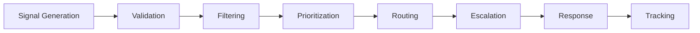

# VSM Protocol: Algedonic Signal Specification

## Overview

The Algedonic Protocol defines the emergency communication system in VSM implementations. Based on Stafford Beer's concept of "algedonic signals" (from Greek "algos" = pain, "hedonic" = pleasure), this protocol enables rapid escalation of critical issues directly to the highest decision-making level (System 5), bypassing normal hierarchical channels.

## Theoretical Foundation

### Cybernetic Principles

The algedonic channel serves as the "nervous system" of the viable system:

- **Immediate Response**: Critical issues reach decision-makers instantly
- **Hierarchy Bypass**: Emergency signals skip intermediate levels
- **Pain/Pleasure Duality**: Both problems and opportunities are communicated
- **Automatic Triggering**: No human intervention required for signal generation

### Beer's Original Concept

> "The algedonic signal is designed to monitor the 'health' of the system and to trigger immediate corrective action when the system's viability is threatened."

## Signal Types

### Pain Signals (`:pain`)
Indicate problems, threats, or degraded performance requiring immediate attention.

```elixir
%AlgedonicSignal{
  type: :pain,
  severity: :critical,
  source: :system1_unit_a,
  description: "Database connection pool exhausted",
  metrics: %{
    connection_usage: 1.0,
    queue_length: 250,
    failure_rate: 0.85
  },
  impact: :service_degradation,
  recommended_actions: [:scale_connections, :throttle_requests]
}
```

### Pleasure Signals (`:pleasure`)
Indicate opportunities, exceptional performance, or positive developments.

```elixir
%AlgedonicSignal{
  type: :pleasure,
  severity: :high,
  source: :system4_analytics,
  description: "Market opportunity detected",
  metrics: %{
    opportunity_score: 0.92,
    market_size: 50_000_000,
    confidence: 0.87
  },
  impact: :revenue_opportunity,
  recommended_actions: [:allocate_resources, :accelerate_development]
}
```

## Severity Levels

### Critical (`:critical`)
**Immediate Action Required** - System viability at risk

- **Response Time**: < 30 seconds
- **Escalation**: Direct to System 5 + Operations team
- **Override**: All rate limits and filters
- **Examples**: Complete service failure, security breach, data corruption

```elixir
%{
  severity: :critical,
  response_sla: 30_000,        # 30 seconds
  escalation_path: [:system5, :operations_team, :executive_team],
  bypass_filters: true,
  requires_acknowledgment: true
}
```

### High (`:high`)
**Urgent Attention Needed** - Performance significantly impacted

- **Response Time**: < 5 minutes
- **Escalation**: System 5 + System 3
- **Override**: Most filters
- **Examples**: High error rates, resource exhaustion, SLA violations

```elixir
%{
  severity: :high,
  response_sla: 300_000,       # 5 minutes
  escalation_path: [:system5, :system3],
  bypass_filters: true,
  requires_acknowledgment: true
}
```

### Medium (`:medium`)
**Important but Not Immediate** - Performance affected but manageable

- **Response Time**: < 30 minutes
- **Escalation**: System 3 with System 5 notification
- **Override**: Some filters
- **Examples**: Elevated latency, capacity warnings, minor failures

```elixir
%{
  severity: :medium,
  response_sla: 1_800_000,     # 30 minutes
  escalation_path: [:system3, :system5],
  bypass_filters: false,
  requires_acknowledgment: false
}
```

### Low (`:low`)
**Informational** - For awareness and trending

- **Response Time**: Best effort
- **Escalation**: Normal channels
- **Override**: No filters bypassed
- **Examples**: Performance trends, capacity planning data

```elixir
%{
  severity: :low,
  response_sla: nil,
  escalation_path: [:system3],
  bypass_filters: false,
  requires_acknowledgment: false
}
```

## Signal Structure

### Core Signal Format

```elixir
defmodule VSMCore.Algedonic.Signal do
  @type signal_type :: :pain | :pleasure
  @type severity :: :critical | :high | :medium | :low
  @type impact :: :viability_threat | :performance_impact | :opportunity | :informational
  
  defstruct [
    :id,                    # Unique signal identifier
    :type,                  # :pain or :pleasure
    :severity,              # Severity level
    :source,                # Originating subsystem/component
    :timestamp,             # Signal creation time
    :description,           # Human-readable description
    :metrics,               # Quantitative measurements
    :context,               # Situational context
    :impact,                # Expected business impact
    :recommended_actions,   # Suggested responses
    :correlation_data,      # Related signals/events
    :metadata               # Additional signal metadata
  ]
end
```

### Field Specifications

#### Required Fields

**`id`** - Unique signal identifier
```elixir
id: "alg_#{:crypto.strong_rand_bytes(8) |> Base.encode16(case: :lower)}"
# Example: "alg_a1b2c3d4e5f6g7h8"
```

**`type`** - Signal classification
```elixir
type: :pain | :pleasure
```

**`severity`** - Urgency level
```elixir
severity: :critical | :high | :medium | :low
```

**`source`** - Signal originator
```elixir
source: :system1 | :system2 | :system3 | :system4 | binary()
# Examples: :system1, :system1_unit_a, "payment_processor"
```

**`timestamp`** - Signal creation time
```elixir
timestamp: DateTime.utc_now()
```

**`description`** - Human-readable explanation
```elixir
description: "Database connection pool has reached 95% capacity"
```

#### Optional Fields

**`metrics`** - Quantitative data
```elixir
metrics: %{
  current_value: 0.95,
  threshold: 0.8,
  trend: :increasing,
  rate_of_change: 0.05
}
```

**`context`** - Situational information
```elixir
context: %{
  environment: :production,
  region: :us_east,
  customer_impact: :high_value_customers,
  business_hours: true
}
```

**`impact`** - Business impact assessment
```elixir
impact: %{
  type: :performance_degradation,
  affected_customers: 1500,
  revenue_at_risk: 50_000,
  sla_breach_risk: 0.8
}
```

**`recommended_actions`** - Suggested responses
```elixir
recommended_actions: [
  {:immediate, :scale_database_connections},
  {:short_term, :implement_connection_pooling},
  {:long_term, :database_sharding_strategy}
]
```

## Signal Generation Patterns

### Automatic Signal Generation

#### Threshold-Based Signals
```elixir
defmodule VSMCore.Algedonic.ThresholdMonitor do
  def check_thresholds(metrics) do
    cond do
      metrics.error_rate > 0.1 ->
        create_pain_signal(:critical, "Error rate critically high", metrics)
        
      metrics.response_time > 5000 ->
        create_pain_signal(:high, "Response time degraded", metrics)
        
      metrics.success_rate > 0.99 and metrics.performance_improvement > 0.2 ->
        create_pleasure_signal(:medium, "Exceptional performance detected", metrics)
        
      true ->
        :no_signal
    end
  end
end
```

#### Pattern-Based Signals
```elixir
defmodule VSMCore.Algedonic.PatternDetector do
  def analyze_patterns(time_series_data) do
    patterns = [
      detect_cascading_failures(time_series_data),
      detect_performance_degradation(time_series_data),
      detect_anomalous_behavior(time_series_data),
      detect_optimization_opportunities(time_series_data)
    ]
    
    patterns
    |> Enum.filter(&signal_required?/1)
    |> Enum.map(&create_pattern_signal/1)
  end
end
```

### Manual Signal Generation

#### Emergency Override
```elixir
# Human operator can manually trigger signals
VSMCore.Algedonic.manual_signal(%{
  type: :pain,
  severity: :critical,
  source: :operations_team,
  description: "Security incident detected - manual escalation",
  override_filters: true,
  requires_immediate_response: true
})
```

#### Opportunity Reporting
```elixir
# System 4 can report strategic opportunities
VSMCore.Algedonic.opportunity_signal(%{
  type: :pleasure,
  severity: :high,
  source: :system4_intelligence,
  description: "New market segment opportunity identified",
  business_value: 2_000_000,
  time_sensitivity: :high
})
```

## Signal Processing Pipeline

### Pipeline Architecture



### Processing Stages

#### 1. Signal Validation
```elixir
defmodule VSMCore.Algedonic.Validator do
  def validate_signal(signal) do
    with :ok <- validate_required_fields(signal),
         :ok <- validate_severity_level(signal),
         :ok <- validate_metrics_format(signal),
         :ok <- validate_source_authorization(signal) do
      {:ok, signal}
    else
      {:error, reason} -> {:error, reason}
    end
  end
end
```

#### 2. Signal Filtering
```elixir
defmodule VSMCore.Algedonic.Filter do
  def apply_filters(signal, config) do
    filters = [
      &duplicate_filter/1,
      &rate_limit_filter/1,
      &noise_reduction_filter/1,
      &business_hours_filter/1
    ]
    
    case signal.severity do
      :critical -> {:pass, signal}  # Critical signals bypass all filters
      _ -> apply_filter_chain(signal, filters)
    end
  end
end
```

#### 3. Signal Prioritization
```elixir
defmodule VSMCore.Algedonic.Prioritizer do
  def calculate_priority(signal) do
    base_priority = severity_priority(signal.severity)
    
    modifiers = [
      business_impact_modifier(signal),
      time_sensitivity_modifier(signal),
      customer_impact_modifier(signal),
      system_state_modifier(signal)
    ]
    
    Enum.reduce(modifiers, base_priority, &apply_modifier/2)
  end
end
```

#### 4. Signal Routing
```elixir
defmodule VSMCore.Algedonic.Router do
  def route_signal(signal) do
    destinations = calculate_destinations(signal)
    
    # Parallel routing for maximum speed
    Task.async_stream(destinations, fn dest ->
      send_signal(signal, dest)
    end, timeout: 5_000)
    |> Enum.to_list()
  end
  
  defp calculate_destinations(signal) do
    case signal.severity do
      :critical -> [:system5, :operations_team, :executive_team]
      :high -> [:system5, :system3]
      :medium -> [:system3, :system5]
      :low -> [:system3]
    end
  end
end
```

## Response and Acknowledgment

### Response Requirements

#### Critical Signal Response
```elixir
defmodule VSMCore.Algedonic.CriticalResponse do
  def handle_critical_signal(signal) do
    # Immediate acknowledgment required
    acknowledge_signal(signal, :received)
    
    # Automatic escalation timer
    escalation_timer = Process.send_after(
      self(), 
      {:escalate_unacknowledged, signal.id}, 
      30_000  # 30 seconds
    )
    
    # Begin response coordination
    coordinate_response(signal)
    
    {:ok, escalation_timer}
  end
end
```

#### Response Tracking
```elixir
defmodule VSMCore.Algedonic.ResponseTracker do
  def track_response(signal_id, response) do
    # Record response timeline
    timeline_entry = %{
      signal_id: signal_id,
      timestamp: DateTime.utc_now(),
      response_type: response.type,
      responder: response.source,
      actions_taken: response.actions,
      effectiveness: response.effectiveness
    }
    
    # Update signal status
    update_signal_status(signal_id, response.status)
    
    # Calculate response metrics
    calculate_response_metrics(signal_id, timeline_entry)
  end
end
```

### Acknowledgment Protocol

#### Acknowledgment Types
```elixir
@acknowledgment_types [
  :received,      # Signal received and understood
  :investigating, # Response team is investigating
  :responding,    # Active response in progress
  :resolved,      # Issue resolved
  :escalated,     # Escalated to higher authority
  :false_alarm    # Signal was not valid
]
```

#### Acknowledgment Format
```elixir
%Acknowledgment{
  signal_id: "alg_a1b2c3d4",
  acknowledger: :system5_operator,
  acknowledgment_type: :investigating,
  timestamp: DateTime.utc_now(),
  estimated_resolution: DateTime.add(DateTime.utc_now(), 300, :second),
  actions_planned: [:scale_resources, :investigate_root_cause],
  additional_resources_needed: false
}
```

## Rate Limiting and Throttling

### Adaptive Rate Limiting
```elixir
defmodule VSMCore.Algedonic.RateLimiter do
  def should_allow_signal?(signal, state) do
    case signal.severity do
      :critical -> true  # Never rate limit critical signals
      
      severity ->
        current_rate = calculate_current_rate(severity, state)
        threshold = get_rate_threshold(severity)
        
        cond do
          current_rate < threshold -> true
          signal_is_unique?(signal, state) -> true
          true -> false
        end
    end
  end
  
  defp get_rate_threshold(severity) do
    case severity do
      :high -> 10    # 10 signals per minute
      :medium -> 5   # 5 signals per minute  
      :low -> 2      # 2 signals per minute
    end
  end
end
```

### Storm Prevention
```elixir
defmodule VSMCore.Algedonic.StormPrevention do
  def detect_signal_storm(recent_signals) do
    storm_indicators = [
      high_frequency_from_same_source(recent_signals),
      similar_signals_in_burst(recent_signals),
      cascading_failure_pattern(recent_signals)
    ]
    
    case Enum.any?(storm_indicators) do
      true -> {:storm_detected, calculate_suppression_strategy(recent_signals)}
      false -> :normal_operation
    end
  end
end
```

## Integration with VSM Subsystems

### System 5 Integration
```elixir
defmodule VSMCore.System5.AlgedonicHandler do
  def handle_algedonic_signal(signal) do
    # Record signal for decision context
    record_signal_for_decision_making(signal)
    
    # Assess impact on organizational identity
    identity_impact = assess_identity_impact(signal)
    
    # Trigger appropriate response based on severity
    case signal.severity do
      :critical -> initiate_crisis_response(signal)
      :high -> schedule_urgent_review(signal)
      _ -> add_to_decision_context(signal)
    end
    
    # Update organizational learning
    update_pattern_recognition(signal)
  end
end
```

### System 3 Integration
```elixir
defmodule VSMCore.System3.AlgedonicHandler do
  def handle_algedonic_signal(signal) do
    case signal.type do
      :pain ->
        # Assess resource allocation impact
        resource_impact = assess_resource_impact(signal)
        
        # Implement immediate mitigations
        implement_mitigations(signal, resource_impact)
        
      :pleasure ->
        # Assess opportunity for resource optimization
        optimization_opportunity = assess_optimization(signal)
        
        # Propose resource reallocation
        propose_reallocation(signal, optimization_opportunity)
    end
    
    # Report to System 5
    report_to_system5(signal, assessment_result)
  end
end
```

## Metrics and Analytics

### Signal Analytics
```elixir
defmodule VSMCore.Algedonic.Analytics do
  def calculate_signal_metrics(time_period) do
    signals = get_signals_for_period(time_period)
    
    %{
      # Volume metrics
      total_signals: length(signals),
      signals_by_type: group_by_type(signals),
      signals_by_severity: group_by_severity(signals),
      
      # Response metrics
      average_response_time: calculate_avg_response_time(signals),
      resolution_rate: calculate_resolution_rate(signals),
      escalation_rate: calculate_escalation_rate(signals),
      
      # Effectiveness metrics
      false_positive_rate: calculate_false_positive_rate(signals),
      signal_accuracy: calculate_signal_accuracy(signals),
      response_effectiveness: calculate_response_effectiveness(signals),
      
      # Trend analysis
      volume_trend: calculate_volume_trend(signals),
      severity_trend: calculate_severity_trend(signals),
      response_time_trend: calculate_response_time_trend(signals)
    }
  end
end
```

### Performance Monitoring
```elixir
# Algedonic system performance metrics
:telemetry.execute(
  [:vsm_core, :algedonic, :performance],
  %{
    signal_processing_time: 25,      # Average processing time (ms)
    routing_latency: 5,              # Average routing latency (ms)
    queue_depth: 3,                  # Current signal queue depth
    filter_effectiveness: 0.92       # Percentage of noise filtered
  },
  %{
    system_load: :normal,
    active_storm_prevention: false
  }
)
```

## Best Practices

### Signal Design Guidelines

1. **Be Specific**: Provide clear, actionable descriptions
2. **Include Context**: Add relevant situational information
3. **Quantify Impact**: Use metrics to show business impact
4. **Suggest Actions**: Recommend specific response actions
5. **Enable Correlation**: Include related event data

### Implementation Guidelines

1. **Fail-Safe Design**: Critical signals must always reach System 5
2. **Performance First**: Optimize for minimal latency
3. **Storm Prevention**: Implement rate limiting and deduplication
4. **Testing**: Regularly test signal pathways
5. **Documentation**: Maintain clear escalation procedures

### Monitoring Guidelines

1. **Track Effectiveness**: Monitor signal accuracy and response times
2. **Prevent Noise**: Filter out non-actionable signals
3. **Learn and Adapt**: Use ML to improve signal detection
4. **Measure Impact**: Track business outcomes from signal responses
5. **Continuous Improvement**: Regularly review and optimize thresholds

---

*The Algedonic Protocol ensures that critical information reaches decision-makers instantly, maintaining system viability through rapid response to threats and opportunities.* 🚨