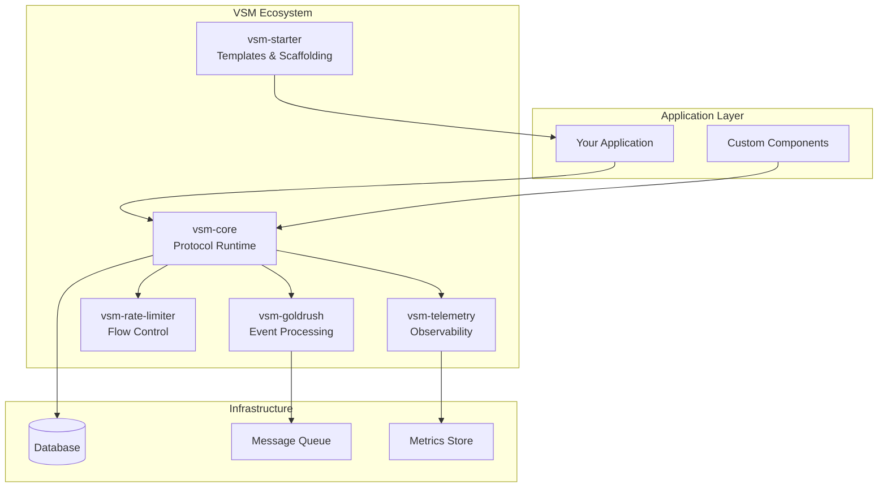

# VSM Protocol: Ecosystem Integration Patterns

## Overview

The VSM Protocol ecosystem consists of multiple interconnected packages that work together to provide comprehensive cybernetic system management. This document outlines proven integration patterns for combining VSM Core with other ecosystem components.

## Ecosystem Architecture



## Integration Pattern 1: Full Stack VSM

### Complete Integration Setup

```elixir
# In your mix.exs
def deps do
  [
    {:vsm_core, "~> 0.1.0"},
    {:vsm_telemetry, "~> 0.1.0"},
    {:vsm_rate_limiter, "~> 0.1.0"},
    {:vsm_goldrush, "~> 0.1.0"}
  ]
end

# In your application supervisor
defmodule MyApp.Application do
  use Application
  
  def start(_type, _args) do
    children = [
      # Core VSM system
      {VSMCore, vsm_core_config()},
      
      # Telemetry and monitoring
      {VSMTelemetry, [
        vsm_system: VSMCore,
        dashboards: [:viability, :performance, :algedonic],
        exporters: [:prometheus, :datadog]
      ]},
      
      # Rate limiting for algedonic signals
      {VSMRateLimiter, [
        channels: [:algedonic_channel],
        limits: rate_limiting_config(),
        escalation: true
      ]},
      
      # Event processing and pattern detection
      {VSMGoldrush, [
        event_source: VSMCore,
        pattern_detection: true,
        ml_models: [:anomaly_detection, :trend_analysis]
      ]},
      
      # Your application services
      MyApp.BusinessLogic,
      MyApp.WebInterface
    ]
    
    Supervisor.start_link(children, strategy: :one_for_one, name: MyApp.Supervisor)
  end
end
```

### Configuration Integration

```elixir
defp vsm_core_config do
  [
    name: :my_company_vsm,
    subsystems: [:s1, :s2, :s3, :s4, :s5],
    
    # Telemetry integration
    telemetry_enabled: true,
    telemetry_target: VSMTelemetry,
    
    # Rate limiting integration
    rate_limiting: [
      enabled: true,
      target: VSMRateLimiter,
      emergency_bypass: true
    ],
    
    # Event processing integration
    event_processing: [
      enabled: true,
      target: VSMGoldrush,
      pattern_detection: true
    ],
    
    # Core configuration
    algedonic_threshold: 0.8,
    variety_management: :adaptive,
    coordination_strategy: :intelligent
  ]
end

defp rate_limiting_config do
  %{
    algedonic_signals: %{
      critical: :unlimited,    # Never limit critical signals
      high: {10, :per_minute}, # 10 per minute max
      medium: {5, :per_minute},
      low: {2, :per_minute}
    },
    
    coordination_messages: %{
      high_priority: {100, :per_second},
      normal: {50, :per_second},
      low_priority: {10, :per_second}
    }
  }
end
```

## Integration Pattern 2: Microservices Architecture

### Service Mesh Integration

```elixir
defmodule MyCompany.VSMServiceMesh do
  @doc """
  Each microservice runs its own VSM subsystem while participating
  in a larger organizational VSM structure.
  """
  
  # Service A: Order Processing (System 1)
  defmodule OrderService.VSM do
    use VSMCore.Protocol
    
    def init(_) do
      state = %{
        subsystem: :system1,
        service_role: :order_processing,
        mesh_coordination: true,
        parent_vsm: :company_wide_vsm
      }
      
      # Connect to service mesh VSM coordination
      VSMCore.connect_to_parent(:company_wide_vsm, :system1)
      
      {:ok, state}
    end
    
    def handle_vsm_message(message, state) do
      case message.source_service do
        :external -> handle_external_request(message, state)
        :internal -> handle_internal_coordination(message, state)
        :parent_vsm -> handle_parent_directive(message, state)
      end
    end
  end
  
  # Service B: Inventory Management (System 1)
  defmodule InventoryService.VSM do
    use VSMCore.Protocol
    
    def init(_) do
      state = %{
        subsystem: :system1,
        service_role: :inventory_management,
        coordination_partners: [:order_processing, :shipping_service]
      }
      
      # Establish coordination channels with peer services
      Enum.each(state.coordination_partners, fn partner ->
        VSMCore.establish_coordination_channel(partner)
      end)
      
      {:ok, state}
    end
  end
  
  # Mesh Coordinator (System 2)
  defmodule MeshCoordinator.VSM do
    use VSMCore.Protocol
    
    def init(_) do
      state = %{
        subsystem: :system2,
        managed_services: [:order_processing, :inventory_management, :shipping_service],
        coordination_strategies: load_coordination_strategies()
      }
      
      {:ok, state}
    end
    
    def handle_coordination_request(request, state) do
      # Implement anti-oscillatory coordination across services
      strategy = select_coordination_strategy(request, state)
      apply_coordination_strategy(strategy, request, state)
    end
  end
end
```

### Inter-Service Communication

```elixir
defmodule MyCompany.InterServiceVSM do
  # VSM-aware message routing between services
  def route_message_between_services(message, source_service, target_service) do
    # Enhance message with VSM metadata
    enhanced_message = %{message |
      metadata: Map.merge(message.metadata, %{
        source_service: source_service,
        target_service: target_service,
        routing_timestamp: DateTime.utc_now(),
        mesh_hop_count: 0
      })
    }
    
    # Route through service mesh with VSM awareness
    case target_service do
      service when service in @local_services ->
        route_locally(enhanced_message, service)
        
      service when service in @remote_services ->
        route_remotely(enhanced_message, service)
        
      :parent_vsm ->
        escalate_to_parent_vsm(enhanced_message)
    end
  end
  
  # Service discovery with VSM subsystem awareness
  def discover_services_by_subsystem(subsystem) do
    # Find all services implementing the specified VSM subsystem
    Registry.lookup(:vsm_service_registry, subsystem)
    |> Enum.map(fn {pid, service_info} ->
      %{
        pid: pid,
        service_name: service_info.name,
        subsystem: subsystem,
        capabilities: service_info.capabilities,
        load: get_service_load(pid),
        variety_capacity: get_variety_capacity(pid)
      }
    end)
    |> Enum.sort_by(& &1.load)  # Sort by load for optimal routing
  end
end
```

## Integration Pattern 3: Event-Driven Architecture

### VSM + Event Sourcing

```elixir
defmodule MyApp.VSMEventSourcing do
  @doc """
  Integrate VSM Core with event sourcing for complete auditability
  and replay capabilities.
  """
  
  # Event store integration
  def setup_vsm_event_sourcing do
    # Configure event store for VSM events
    event_store_config = [
      name: :vsm_event_store,
      adapter: EventStore.Adapters.Postgres,
      serializer: VSMEventSerializer,
      
      # VSM-specific event streams
      streams: [
        "vsm-system1-operations",
        "vsm-system2-coordination", 
        "vsm-system3-control",
        "vsm-system4-intelligence",
        "vsm-system5-policy",
        "vsm-algedonic-signals",
        "vsm-variety-measurements"
      ]
    ]
    
    {:ok, event_store} = EventStore.start_link(event_store_config)
    
    # VSM event handlers
    handlers = [
      {VSMCore.EventHandlers.OperationsHandler, stream: "vsm-system1-operations"},
      {VSMCore.EventHandlers.CoordinationHandler, stream: "vsm-system2-coordination"},
      {VSMCore.EventHandlers.ControlHandler, stream: "vsm-system3-control"},
      {VSMCore.EventHandlers.IntelligenceHandler, stream: "vsm-system4-intelligence"},
      {VSMCore.EventHandlers.PolicyHandler, stream: "vsm-system5-policy"},
      {VSMCore.EventHandlers.AlgedonicHandler, stream: "vsm-algedonic-signals"}
    ]
    
    # Subscribe handlers to event streams
    Enum.each(handlers, fn {handler, opts} ->
      EventStore.subscribe_to_stream(
        event_store,
        opts.stream,
        handler,
        start_from: :current
      )
    end)
    
    {:ok, event_store, handlers}
  end
  
  # VSM event serializer
  defmodule VSMEventSerializer do
    def serialize(%VSMCore.Events.OperationExecuted{} = event) do
      Jason.encode!(%{
        type: "OperationExecuted",
        subsystem: :system1,
        data: %{
          operation_id: event.operation_id,
          input_variety: event.input_variety,
          output_variety: event.output_variety,
          execution_time: event.execution_time,
          result: event.result
        },
        metadata: %{
          timestamp: event.timestamp,
          version: 1
        }
      })
    end
    
    def serialize(%VSMCore.Events.AlgedonicSignalEmitted{} = event) do
      Jason.encode!(%{
        type: "AlgedonicSignalEmitted",
        subsystem: :algedonic_channel,
        data: %{
          signal_id: event.signal_id,
          signal_type: event.signal_type,
          severity: event.severity,
          source: event.source,
          description: event.description,
          metrics: event.metrics
        },
        metadata: %{
          timestamp: event.timestamp,
          escalation_path: event.escalation_path,
          version: 1
        }
      })
    end
  end
end
```

### Event Pattern Detection with VSM Goldrush

```elixir
defmodule MyApp.VSMPatternDetection do
  @doc """
  Use VSM Goldrush for sophisticated pattern detection across
  the entire VSM ecosystem.
  """
  
  def setup_pattern_detection do
    # Configure Goldrush for VSM pattern detection
    {:ok, goldrush} = VSMGoldrush.start_link([
      name: :vsm_pattern_detector,
      
      # Event sources
      sources: [
        {VSMCore, event_types: :all},
        {VSMTelemetry, event_types: [:metrics, :alerts]},
        {VSMRateLimiter, event_types: [:rate_exceeded, :backpressure]}
      ],
      
      # Pattern detection models
      models: [
        VSMGoldrush.Models.CascadingFailure,
        VSMGoldrush.Models.PerformanceDegradation,
        VSMGoldrush.Models.LoadOscillation,
        VSMGoldrush.Models.VarietyImbalance,
        VSMGoldrush.Models.EmergingOpportunity
      ],
      
      # Pattern actions
      actions: [
        {VSMGoldrush.Actions.AutoScale, triggers: [:load_increase_pattern]},
        {VSMGoldrush.Actions.AlgedonicAlert, triggers: [:failure_cascade_pattern]},
        {VSMGoldrush.Actions.CoordinationAdjustment, triggers: [:oscillation_pattern]}
      ]
    ])
    
    {:ok, goldrush}
  end
  
  # Custom VSM pattern definitions
  defmodule VSMPatterns do
    # Detect variety imbalance patterns
    def variety_imbalance_pattern do
      VSMGoldrush.Pattern.define([
        # Look for consistently high input variety
        {:sequence, [
          {:event, [:vsm_core, :variety, :calculated], 
           %{input_variety: {:>, 8.0}}, within: :seconds_30},
          {:event, [:vsm_core, :variety, :calculated], 
           %{input_variety: {:>, 8.0}}, within: :seconds_30},
          {:event, [:vsm_core, :variety, :calculated], 
           %{input_variety: {:>, 8.0}}, within: :seconds_30}
        ]},
        
        # With low output variety (under-controlling)
        {:concurrent, [
          {:event, [:vsm_core, :variety, :calculated], 
           %{output_variety: {:<, 2.0}}}
        ]}
      ])
    end
    
    # Detect coordination oscillation
    def coordination_oscillation_pattern do
      VSMGoldrush.Pattern.define([
        # Rapid coordination adjustments
        {:frequency, [
          {:event, [:vsm_core, :system2, :coordination], 
           %{action: :adjust}, count: {:>, 10}, within: :minutes_5}
        ]},
        
        # With increasing adjustment magnitude
        {:trend, [
          {:metric, :adjustment_magnitude, direction: :increasing}
        ]}
      ])
    end
    
    # Detect emerging business opportunity
    def opportunity_emergence_pattern do
      VSMGoldrush.Pattern.define([
        # Performance improvement trend
        {:trend, [
          {:metric, :performance_score, direction: :increasing, 
           duration: :minutes_15, confidence: 0.8}
        ]},
        
        # With capacity available
        {:concurrent, [
          {:event, [:vsm_core, :system3, :resources], 
           %{utilization: {:<, 0.7}}}
        ]},
        
        # And positive external indicators
        {:recent, [
          {:event, [:vsm_core, :system4, :scan], 
           %{market_sentiment: :positive}}
        ]}
      ])
    end
  end
end
```

## Integration Pattern 4: Cloud-Native VSM

### Kubernetes Integration

```yaml
# vsm-deployment.yaml
apiVersion: apps/v1
kind: Deployment
metadata:
  name: vsm-core
  labels:
    app: vsm-core
    vsm.component: core
spec:
  replicas: 3
  selector:
    matchLabels:
      app: vsm-core
  template:
    metadata:
      labels:
        app: vsm-core
        vsm.subsystem: all
      annotations:
        vsm.protocol/version: "1.0"
        vsm.protocol/telemetry: "enabled"
    spec:
      containers:
      - name: vsm-core
        image: mycompany/vsm-core:latest
        ports:
        - containerPort: 4000
          name: http
        - containerPort: 4001
          name: vsm-protocol
        env:
        - name: VSM_CLUSTER_MODE
          value: "kubernetes"
        - name: VSM_TELEMETRY_ENDPOINT
          value: "http://vsm-telemetry:8080"
        - name: VSM_RATE_LIMITER_ENDPOINT
          value: "http://vsm-rate-limiter:8081"
        livenessProbe:
          httpGet:
            path: /health
            port: 4000
          initialDelaySeconds: 30
          periodSeconds: 10
        readinessProbe:
          httpGet:
            path: /ready
            port: 4000
          initialDelaySeconds: 5
          periodSeconds: 5

---
apiVersion: v1
kind: Service
metadata:
  name: vsm-core
  labels:
    app: vsm-core
    vsm.component: core
spec:
  selector:
    app: vsm-core
  ports:
  - name: http
    port: 80
    targetPort: 4000
  - name: vsm-protocol
    port: 4001
    targetPort: 4001
```

### Container Orchestration

```elixir
defmodule MyApp.VSMContainerOrchestration do
  @doc """
  Coordinate VSM components across container infrastructure
  """
  
  def setup_containerized_vsm do
    # Service discovery for VSM components
    discovery_config = [
      strategy: :kubernetes_dns,
      services: [
        vsm_core: "vsm-core.default.svc.cluster.local:4001",
        vsm_telemetry: "vsm-telemetry.default.svc.cluster.local:8080",
        vsm_rate_limiter: "vsm-rate-limiter.default.svc.cluster.local:8081",
        vsm_goldrush: "vsm-goldrush.default.svc.cluster.local:8082"
      ]
    ]
    
    # Cluster formation for VSM coordination
    cluster_config = [
      name: :vsm_cluster,
      strategy: Cluster.Strategy.Kubernetes.DNS,
      config: [
        service: "vsm-core",
        application_name: "vsm_core"
      ]
    ]
    
    # Start cluster formation
    {:ok, _} = Cluster.Supervisor.start_link([cluster_config])
    
    # Wait for cluster to form
    :ok = wait_for_cluster_formation()
    
    # Initialize distributed VSM coordination
    VSMCore.Cluster.init_distributed_coordination()
  end
  
  def handle_node_join(node) do
    # When new VSM node joins cluster
    Logger.info("VSM node joined cluster: #{node}")
    
    # Share VSM state with new node
    VSMCore.Cluster.sync_state_to_node(node)
    
    # Rebalance subsystem distribution
    VSMCore.Cluster.rebalance_subsystems()
    
    # Update coordination topology
    VSMCore.System2.update_coordination_topology()
  end
  
  def handle_node_leave(node) do
    # When VSM node leaves cluster
    Logger.warn("VSM node left cluster: #{node}")
    
    # Redistribute subsystems from failed node
    orphaned_subsystems = VSMCore.Cluster.get_orphaned_subsystems(node)
    VSMCore.Cluster.redistribute_subsystems(orphaned_subsystems)
    
    # Trigger algedonic signal if critical capacity lost
    if critical_capacity_lost?(node, orphaned_subsystems) do
      VSMCore.Algedonic.emit_signal(%{
        type: :pain,
        severity: :high,
        source: :cluster_management,
        description: "Critical VSM capacity lost due to node failure",
        affected_subsystems: orphaned_subsystems
      })
    end
  end
end
```

## Integration Pattern 5: Multi-Tenant VSM

### Tenant Isolation

```elixir
defmodule MyApp.MultiTenantVSM do
  @doc """
  Implement VSM for multi-tenant SaaS applications with proper isolation
  """
  
  def setup_tenant_vsm(tenant_id) do
    # Create isolated VSM instance for tenant
    vsm_config = [
      name: :"vsm_#{tenant_id}",
      tenant_id: tenant_id,
      isolation_level: :strong,
      
      # Tenant-specific configuration
      subsystem_config: get_tenant_config(tenant_id),
      resource_limits: get_tenant_limits(tenant_id),
      
      # Shared services (with tenant isolation)
      telemetry_target: {:shared, VSMTelemetry, tenant: tenant_id},
      rate_limiter: {:shared, VSMRateLimiter, tenant: tenant_id}
    ]
    
    {:ok, vsm_pid} = VSMCore.start_link(vsm_config)
    
    # Register tenant VSM instance
    Registry.register(:tenant_vsm_registry, tenant_id, vsm_pid)
    
    {:ok, vsm_pid}
  end
  
  def route_tenant_message(tenant_id, message) do
    # Route message to appropriate tenant VSM instance
    case Registry.lookup(:tenant_vsm_registry, tenant_id) do
      [{vsm_pid, _}] ->
        VSMCore.send_message(vsm_pid, message)
        
      [] ->
        # Auto-provision VSM for new tenant
        {:ok, vsm_pid} = setup_tenant_vsm(tenant_id)
        VSMCore.send_message(vsm_pid, message)
    end
  end
  
  def get_tenant_metrics(tenant_id) do
    # Get VSM metrics for specific tenant
    case Registry.lookup(:tenant_vsm_registry, tenant_id) do
      [{vsm_pid, _}] ->
        VSMCore.get_metrics(vsm_pid)
        
      [] ->
        {:error, :tenant_not_found}
    end
  end
  
  # Cross-tenant coordination (for shared resources)
  def coordinate_across_tenants(resource_type) do
    all_tenants = Registry.select(:tenant_vsm_registry, [{{:"$1", :"$2", :_}, [], [{{:"$1", :"$2"}}]}])
    
    # Gather resource usage from all tenants
    resource_usage = Enum.map(all_tenants, fn {tenant_id, vsm_pid} ->
      usage = VSMCore.get_resource_usage(vsm_pid, resource_type)
      {tenant_id, usage}
    end)
    
    # Apply cross-tenant coordination strategy
    coordination_strategy = select_coordination_strategy(resource_type, resource_usage)
    apply_cross_tenant_coordination(coordination_strategy, all_tenants)
  end
end
```

## Performance Optimization Patterns

### Horizontal Scaling

```elixir
defmodule MyApp.VSMHorizontalScaling do
  def setup_auto_scaling_vsm do
    # Auto-scaling configuration
    scaling_config = [
      # Scaling triggers
      triggers: [
        {:variety_overload, threshold: 0.9, action: :scale_out},
        {:response_time_degradation, threshold: 1000, action: :scale_out},
        {:algedonic_signal_frequency, threshold: 10, window: :minutes_5, action: :scale_out},
        {:low_utilization, threshold: 0.3, duration: :minutes_10, action: :scale_in}
      ],
      
      # Scaling constraints  
      min_instances: 2,
      max_instances: 20,
      scale_cooldown: :minutes_5,
      
      # VSM-aware scaling
      preserve_subsystem_distribution: true,
      maintain_coordination_topology: true
    ]
    
    {:ok, scaler} = VSMCore.AutoScaler.start_link(scaling_config)
    
    # Monitor VSM metrics for scaling decisions
    :telemetry.attach_many(
      "vsm-auto-scaling",
      [
        [:vsm_core, :variety, :calculated],
        [:vsm_core, :performance, :measured],
        [:vsm_core, :algedonic, :signal]
      ],
      &VSMCore.AutoScaler.handle_telemetry_event/4,
      scaler
    )
    
    {:ok, scaler}
  end
end
```

## Best Practices for Ecosystem Integration

### 1. Gradual Integration Strategy

```elixir
# Phase 1: Core VSM
{:ok, _} = VSMCore.start_link(basic_config())

# Phase 2: Add Telemetry
{:ok, _} = VSMTelemetry.start_link(vsm_system: VSMCore)

# Phase 3: Add Rate Limiting  
{:ok, _} = VSMRateLimiter.start_link(vsm_system: VSMCore)

# Phase 4: Add Event Processing
{:ok, _} = VSMGoldrush.start_link(vsm_system: VSMCore)
```

### 2. Configuration Management

```elixir
# Centralized configuration for entire ecosystem
defmodule MyApp.VSMConfig do
  def ecosystem_config do
    %{
      core: vsm_core_config(),
      telemetry: vsm_telemetry_config(),
      rate_limiter: vsm_rate_limiter_config(), 
      goldrush: vsm_goldrush_config(),
      
      # Integration settings
      integration: %{
        message_format_version: "1.0",
        telemetry_batch_size: 100,
        rate_limit_bypass_critical: true,
        pattern_detection_sensitivity: 0.8
      }
    }
  end
end
```

### 3. Health Monitoring

```elixir
defmodule MyApp.VSMEcosystemHealth do
  def check_ecosystem_health do
    components = [
      {:vsm_core, VSMCore},
      {:vsm_telemetry, VSMTelemetry},
      {:vsm_rate_limiter, VSMRateLimiter},
      {:vsm_goldrush, VSMGoldrush}
    ]
    
    health_results = Enum.map(components, fn {name, module} ->
      health = module.health_check()
      {name, health}
    end)
    
    overall_health = calculate_overall_health(health_results)
    
    %{
      overall: overall_health,
      components: Map.new(health_results),
      timestamp: DateTime.utc_now()
    }
  end
end
```

### 4. Upgrade Strategies

```elixir
defmodule MyApp.VSMEcosystemUpgrade do
  def rolling_upgrade(components) do
    # Upgrade ecosystem components one by one
    Enum.reduce(components, :ok, fn component, :ok ->
      case upgrade_component(component) do
        :ok -> 
          verify_component_health(component)
        error -> 
          rollback_component(component)
          error
      end
    end)
  end
  
  defp upgrade_component(component) do
    # Graceful component upgrade with VSM state preservation
    old_state = component.get_state()
    :ok = component.stop()
    :ok = component.upgrade()
    :ok = component.start()
    :ok = component.restore_state(old_state)
  end
end
```

---

*These integration patterns enable you to build comprehensive, production-ready VSM ecosystems that scale and adapt to your specific requirements.* 🔗