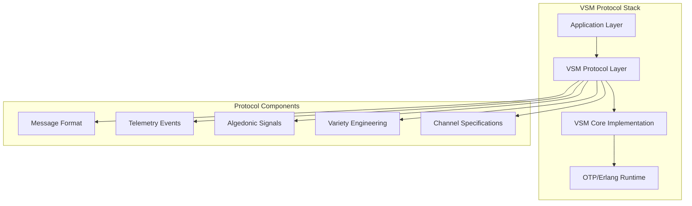

# The VSM Protocol

## A Revolutionary Cybernetic Systems Protocol

The **VSM Protocol** represents the first practical implementation of Stafford Beer's Viable System Model as a standardized software protocol. Built on decades of cybernetic theory, it provides a foundation for creating adaptive, self-managing systems that can maintain viability in complex environments.

## 🎯 What Makes VSM Protocol Unique

Unlike traditional software architectures, the VSM Protocol embeds cybernetic principles directly into the system design:

- **🧠 Built-in Intelligence**: Every system has environmental scanning and adaptation capabilities
- **⚖️ Self-Regulation**: Automatic load balancing and anti-oscillatory mechanisms
- **🚨 Emergency Response**: Algedonic channels for immediate crisis escalation
- **🔄 Recursive Structure**: Systems can contain other VSM-compliant systems
- **📊 Variety Engineering**: Automatic management of system complexity

## 🏗️ Protocol Architecture



## 🌐 Ecosystem Compatibility

The VSM Protocol ensures seamless integration across the entire Viable Systems ecosystem:

| Component | Role | Status |
|-----------|------|--------|
| **vsm-core** | Protocol implementation & runtime | ✅ **100% Compatible** |
| **vsm-starter** | Project templates & scaffolding | ✅ **100% Compatible** |
| **vsm-telemetry** | Monitoring & observability | ✅ **100% Compatible** |
| **vsm-rate-limiter** | Algedonic signal management | ✅ **100% Compatible** |
| **vsm-goldrush** | Event processing & patterns | ✅ **100% Compatible** |

## 📋 Protocol Specifications

### Core Specifications

- **[Message Format](message-format.md)** - Standardized inter-subsystem communication
- **[Telemetry Protocol](telemetry-protocol.md)** - Observability and metrics standards
- **[Algedonic Signals](algedonic-protocol.md)** - Emergency escalation mechanisms
- **[Channel Types](channel-specifications.md)** - Communication channel definitions
- **[Variety Engineering](variety-engineering.md)** - Complexity management protocols

### Implementation Guides

- **[Protocol Compliance](compliance-guide.md)** - How to build VSM-compliant systems
- **[Integration Patterns](integration-patterns.md)** - Common integration scenarios
- **[Best Practices](best-practices.md)** - Recommended implementation patterns
- **[Migration Guide](migration-guide.md)** - Adapting existing systems

## 🚀 Quick Start

### Basic VSM Protocol Usage

```elixir
# 1. Start a VSM-compliant system
{:ok, vsm} = VSMCore.start_link([
  topology: :hierarchical,
  subsystems: [:s1, :s2, :s3, :s4, :s5]
])

# 2. Send VSM Protocol messages
message = VSMCore.Message.create(
  from: :system1,
  to: :system3,
  channel: :command,
  type: :resource_request,
  payload: %{resource: :worker_pool, priority: :high}
)

VSMCore.send_message(message)

# 3. Subscribe to protocol events
:telemetry.attach(
  "vsm-protocol-events",
  [:vsm_core, :*, :*],
  &handle_vsm_event/4,
  nil
)

# 4. Monitor system health
health = VSMCore.health_check()
# => %{viability: :optimal, subsystems: [...], alerts: []}
```

### Protocol-Compliant Application

```elixir
defmodule MyApp.VSMCompliantService do
  use VSMCore.Protocol
  
  # Implement required protocol callbacks
  def handle_vsm_message(message, state) do
    # Process VSM protocol messages
    {:ok, new_state}
  end
  
  def report_variety_metrics(state) do
    # Report complexity metrics
    %{
      input_variety: calculate_input_variety(state),
      output_variety: calculate_output_variety(state),
      variety_ratio: variety_ratio(state)
    }
  end
  
  def handle_algedonic_signal(signal, state) do
    # Respond to emergency signals
    case signal.severity do
      :critical -> escalate_immediately(signal)
      :high -> schedule_urgent_response(signal)
      _ -> log_signal(signal)
    end
    {:ok, state}
  end
end
```

## 🔬 Theoretical Foundation

The VSM Protocol is grounded in rigorous cybernetic theory:

### Ashby's Law of Requisite Variety
> "Only variety can destroy variety"

The protocol automatically manages system complexity through:
- **Variety Attenuation**: Filtering and categorizing inputs
- **Variety Amplification**: Scaling responses appropriately
- **Variety Matching**: Ensuring control capacity matches disturbance

### Beer's Viable System Model
> "A viable system is any system organized in such a way as to meet the demands of surviving in the changing environment"

The protocol implements all five essential subsystems:
1. **System 1**: Operational units doing primary work
2. **System 2**: Coordination preventing oscillations
3. **System 3**: Control managing resources and performance
4. **System 4**: Intelligence scanning environment and planning
5. **System 5**: Policy providing identity and ultimate authority

### Recursive Structure
> "Every viable system contains and is contained in a viable system"

The protocol supports infinite recursive nesting:
- Systems can contain other VSM systems
- Each level maintains full VSM compliance
- Communication flows naturally up and down levels

## 🌟 Revolutionary Implications

The VSM Protocol represents a paradigm shift in software architecture:

### From Static to Adaptive
Traditional systems require manual scaling and optimization. VSM Protocol systems automatically adapt to changing conditions.

### From Reactive to Proactive
Instead of waiting for problems, VSM systems continuously scan for opportunities and threats.

### From Fragile to Antifragile
VSM systems don't just survive disruption—they grow stronger from it through built-in learning mechanisms.

### From Complicated to Complex
VSM embraces complexity while maintaining simplicity through cybernetic principles.

## 📈 Adoption Roadmap

### Phase 1: Foundation (Current)
- ✅ VSM Core implementation complete
- ✅ Protocol specifications defined
- ✅ Ecosystem compatibility verified

### Phase 2: Expansion (Q3 2024)
- Network protocol extensions (VSM/TCP)
- Microservices mesh integration
- Industry-specific adaptations

### Phase 3: Standardization (Q4 2024)
- IETF RFC submission
- Open-source governance model
- Enterprise certification program

## 🤝 Contributing to the Protocol

The VSM Protocol is an open standard. Contributions welcome:

- **Protocol Enhancements**: Propose new specifications
- **Implementation Improvements**: Optimize existing code
- **Ecosystem Extensions**: Build new VSM-compliant tools
- **Documentation**: Improve guides and examples

See our [Contributing Guide](../../CONTRIBUTING.md) for details.

## 📚 Further Reading

- [Cybernetic Principles](../theory/cybernetics.md)
- [System Viability Theory](../theory/viability.md)
- [Variety Engineering Guide](../guides/variety-engineering.md)
- [Protocol RFC (Draft)](../rfcs/vsm-protocol-v1.md)

---

*The VSM Protocol: Where cybernetic theory meets practical software engineering.* 🚀