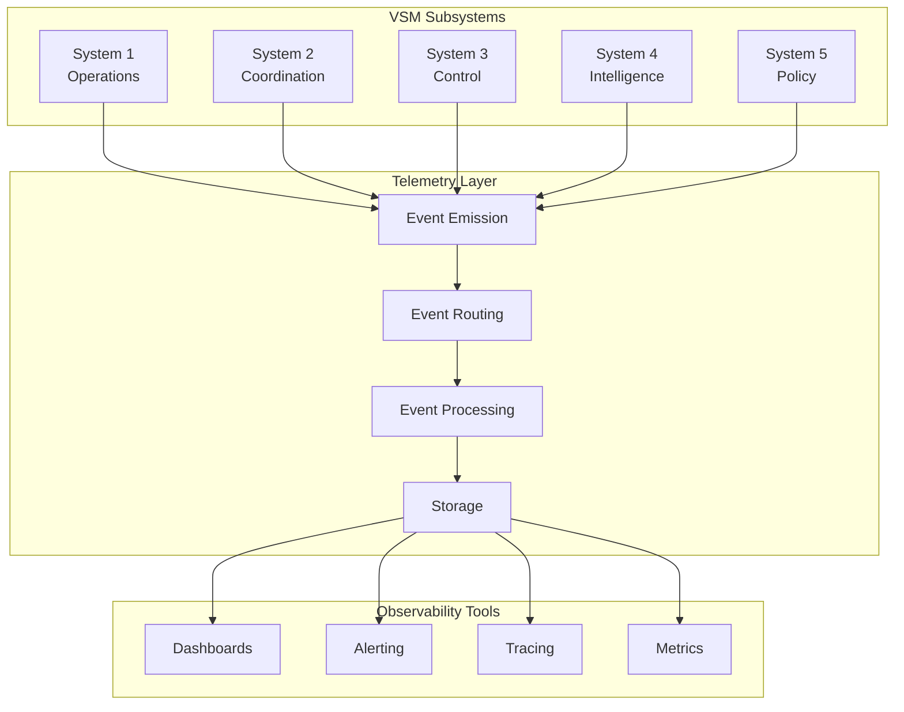

# VSM Protocol: Telemetry Specification

## Overview

The VSM Telemetry Protocol defines standardized observability patterns for Viable Systems. It provides comprehensive monitoring, metrics collection, and event emission that align with cybernetic principles and enable effective system management.

## Telemetry Architecture

### Event-Driven Observability



## Event Naming Convention

### Standard Event Pattern
```
[:vsm_core, subsystem, component, action?]
```

### Event Categories

#### Core System Events
```elixir
# System startup/shutdown
[:vsm_core, :system, :started]
[:vsm_core, :system, :stopped]
[:vsm_core, :system, :health_check]

# Subsystem lifecycle
[:vsm_core, :system1, :started]
[:vsm_core, :system2, :coordination, :enabled]
[:vsm_core, :system3, :control, :activated]
[:vsm_core, :system4, :intelligence, :scanning]
[:vsm_core, :system5, :policy, :decision_made]
```

#### Operational Events (System 1)
```elixir
# Transaction processing
[:vsm_core, :system1, :transaction, :started]
[:vsm_core, :system1, :transaction, :completed]
[:vsm_core, :system1, :transaction, :failed]

# Unit operations
[:vsm_core, :system1, :unit, :created]
[:vsm_core, :system1, :unit, :scaled]
[:vsm_core, :system1, :unit, :performance]

# Variety measurement
[:vsm_core, :system1, :variety, :calculated]
[:vsm_core, :system1, :variety, :threshold_exceeded]
```

#### Coordination Events (System 2)
```elixir
# Anti-oscillation
[:vsm_core, :system2, :oscillation, :detected]
[:vsm_core, :system2, :oscillation, :dampened]

# Load balancing
[:vsm_core, :system2, :balance, :rebalanced]
[:vsm_core, :system2, :balance, :conflict_resolved]

# Coordination actions
[:vsm_core, :system2, :coordination, :sync_requested]
[:vsm_core, :system2, :coordination, :sync_completed]
```

#### Control Events (System 3)
```elixir
# Resource management
[:vsm_core, :system3, :resources, :allocated]
[:vsm_core, :system3, :resources, :deallocated]
[:vsm_core, :system3, :resources, :optimized]

# Performance monitoring
[:vsm_core, :system3, :performance, :measured]
[:vsm_core, :system3, :performance, :threshold_exceeded]

# Audit operations (System 3*)
[:vsm_core, :system3, :audit, :started]
[:vsm_core, :system3, :audit, :completed]
[:vsm_core, :system3, :audit, :violation_detected]
```

#### Intelligence Events (System 4)
```elixir
# Environmental scanning
[:vsm_core, :system4, :scan, :started]
[:vsm_core, :system4, :scan, :completed]
[:vsm_core, :system4, :scan, :threat_detected]
[:vsm_core, :system4, :scan, :opportunity_identified]

# Forecasting
[:vsm_core, :system4, :forecast, :generated]
[:vsm_core, :system4, :forecast, :accuracy_measured]

# Adaptation recommendations
[:vsm_core, :system4, :adaptation, :proposed]
[:vsm_core, :system4, :adaptation, :approved]
```

#### Policy Events (System 5)
```elixir
# Decision making
[:vsm_core, :system5, :decision, :requested]
[:vsm_core, :system5, :decision, :made]
[:vsm_core, :system5, :decision, :implemented]

# Value alignment
[:vsm_core, :system5, :values, :assessed]
[:vsm_core, :system5, :values, :violation_detected]

# Identity evolution
[:vsm_core, :system5, :identity, :updated]
[:vsm_core, :system5, :identity, :conflict_resolved]
```

#### Channel Events
```elixir
# Algedonic signals
[:vsm_core, :algedonic, :signal, :emitted]
[:vsm_core, :algedonic, :signal, :escalated]
[:vsm_core, :algedonic, :alert, :created]

# Temporal variety
[:vsm_core, :temporal, :variety, :measured]
[:vsm_core, :temporal, :pattern, :detected]
[:vsm_core, :temporal, :forecast, :updated]

# Message channels
[:vsm_core, :channel, :message, :sent]
[:vsm_core, :channel, :message, :received]
[:vsm_core, :channel, :message, :dropped]
```

## Event Data Structure

### Standard Event Format

```elixir
:telemetry.execute(
  event_name,        # List of atoms defining the event
  measurements,      # Map of numeric measurements
  metadata          # Map of contextual information
)
```

### Measurements Specification

#### Core Measurements
```elixir
# Common across all events
%{
  count: integer(),           # Event occurrence count
  duration: integer(),        # Duration in microseconds (if applicable)
  timestamp: integer()        # System monotonic time
}

# Performance measurements
%{
  latency_p50: float(),      # 50th percentile latency
  latency_p95: float(),      # 95th percentile latency  
  latency_p99: float(),      # 99th percentile latency
  throughput: float(),       # Operations per second
  error_rate: float(),       # Error percentage (0.0-1.0)
  cpu_usage: float(),        # CPU utilization (0.0-1.0)
  memory_usage: integer()    # Memory usage in bytes
}

# Variety measurements (cybernetic)
%{
  input_variety: float(),     # Input complexity measure
  output_variety: float(),    # Output complexity measure
  variety_ratio: float(),     # Output/Input ratio
  entropy: float(),          # Shannon entropy
  requisite_variety: float() # Required variety for control
}
```

### Metadata Specification

#### Core Metadata
```elixir
%{
  subsystem: atom(),         # Source subsystem (:system1, :system2, etc.)
  component: binary(),       # Component identifier
  node: atom(),             # Erlang node name
  pid: pid(),               # Process identifier
  trace_id: binary(),       # Distributed trace identifier
  span_id: binary(),        # Trace span identifier
  correlation_id: binary()  # Request correlation identifier
}

# Operational metadata
%{
  transaction_type: atom(),  # Type of transaction
  unit_id: binary(),        # Operational unit identifier
  resource_type: atom(),    # Resource being managed
  priority: atom(),         # Message/operation priority
  source: atom(),           # Event source component
  target: atom()            # Event target component
}

# Cybernetic metadata
%{
  variety_level: atom(),     # :low, :medium, :high, :critical
  control_effectiveness: float(), # How well variety is managed
  adaptation_trigger: boolean(),  # Whether adaptation is needed
  emergency_level: atom(),   # :none, :warning, :critical, :emergency
  viability_impact: atom()  # :positive, :neutral, :negative, :critical
}
```

## Metrics Collection Patterns

### System Health Metrics

```elixir
# Overall system health
:telemetry.execute(
  [:vsm_core, :system, :health],
  %{
    viability_score: 0.92,      # Overall viability (0.0-1.0)
    subsystem_health: 5,        # Number of healthy subsystems
    alert_count: 2,             # Active alerts
    response_time: 150          # Average response time (ms)
  },
  %{
    check_type: :comprehensive,
    severity_breakdown: %{low: 1, medium: 1, high: 0, critical: 0}
  }
)

# Variety engineering effectiveness
:telemetry.execute(
  [:vsm_core, :variety, :engineering],
  %{
    attenuation_ratio: 0.85,    # How well variety is reduced
    amplification_ratio: 12.3,  # How well responses are amplified
    control_capacity: 0.78,     # Current control effectiveness
    variety_balance: 0.92       # How well variety is balanced
  },
  %{
    engineering_strategy: :adaptive,
    last_adjustment: DateTime.utc_now()
  }
)
```

### Performance Metrics

```elixir
# Transaction performance
:telemetry.execute(
  [:vsm_core, :system1, :transaction],
  %{
    count: 1,
    duration: 2_450,            # Microseconds
    cpu_time: 1_200,
    memory_allocated: 4_096
  },
  %{
    transaction_type: :order_processing,
    unit_id: "worker_pool_a",
    priority: :high,
    result: :success
  }
)

# Resource utilization
:telemetry.execute(
  [:vsm_core, :system3, :resources],
  %{
    cpu_utilization: 0.67,
    memory_utilization: 0.45,
    connection_count: 23,
    queue_depth: 5
  },
  %{
    resource_pool: "primary",
    allocation_strategy: :dynamic,
    optimization_cycle: 42
  }
)
```

### Cybernetic Metrics

```elixir
# Algedonic signal metrics
:telemetry.execute(
  [:vsm_core, :algedonic, :signal],
  %{
    count: 1,
    severity_score: 0.85,       # Severity (0.0-1.0)
    propagation_time: 50,       # Time to reach S5 (ms)
    response_time: 1_200        # Time to response (ms)
  },
  %{
    signal_type: :pain,
    source_subsystem: :system1,
    escalation_path: [:system1, :system5],
    bypass_hierarchy: true,
    auto_resolved: false
  }
)

# Coordination effectiveness
:telemetry.execute(
  [:vsm_core, :system2, :coordination],
  %{
    oscillation_damping: 0.92,  # How well oscillations are controlled
    conflict_resolution_time: 890, # Average resolution time (ms)
    coordination_success_rate: 0.95,
    load_balance_effectiveness: 0.88
  },
  %{
    coordination_strategy: :adaptive,
    units_coordinated: 5,
    conflicts_resolved: 3
  }
)
```

## Event Aggregation and Analysis

### Time-Series Aggregation

```elixir
# Define aggregation windows
aggregation_windows = [
  :seconds_30,   # Real-time monitoring
  :minutes_5,    # Operational dashboards  
  :minutes_15,   # Trend analysis
  :hours_1,      # Performance reports
  :hours_24,     # Daily summaries
  :days_7        # Weekly analysis
]

# Aggregation functions
aggregation_functions = [
  :count,        # Event counts
  :sum,          # Totals
  :mean,         # Averages
  :median,       # Median values
  :p95,          # 95th percentile
  :p99,          # 99th percentile
  :min,          # Minimum values
  :max,          # Maximum values
  :stddev        # Standard deviation
]
```

### Cybernetic Analysis Patterns

```elixir
# Variety trend analysis
def analyze_variety_trends(events) do
  events
  |> group_by_time_window(:minutes_15)
  |> calculate_variety_metrics()
  |> detect_variety_patterns()
  |> forecast_variety_requirements()
end

# Viability assessment
def assess_system_viability(metrics) do
  %{
    s1_effectiveness: assess_operational_effectiveness(metrics),
    s2_coordination: assess_coordination_quality(metrics),
    s3_control: assess_control_effectiveness(metrics),
    s4_intelligence: assess_intelligence_quality(metrics),
    s5_policy: assess_policy_alignment(metrics),
    overall_viability: calculate_overall_viability(metrics)
  }
end
```

## Integration with Observability Tools

### Prometheus Integration

```elixir
# Counter metrics
defmodule VSMCore.Telemetry.Prometheus do
  use Prometheus.Metric
  
  # Define VSM-specific metrics
  def setup do
    Counter.declare([
      name: :vsm_transactions_total,
      help: "Total number of VSM transactions",
      labels: [:subsystem, :transaction_type, :result]
    ])
    
    Gauge.declare([
      name: :vsm_variety_ratio,
      help: "Current variety ratio (output/input)",
      labels: [:subsystem, :component]
    ])
    
    Histogram.declare([
      name: :vsm_response_duration_seconds,
      help: "Response duration in seconds",
      labels: [:subsystem, :operation],
      buckets: [0.001, 0.005, 0.01, 0.05, 0.1, 0.5, 1.0, 5.0]
    ])
  end
end

# Event handler
def handle_telemetry_event(event, measurements, metadata, _config) do
  case event do
    [:vsm_core, :system1, :transaction] ->
      Counter.inc(:vsm_transactions_total, [
        metadata.subsystem,
        metadata.transaction_type,
        metadata.result
      ])
      
    [:vsm_core, :variety, :calculated] ->
      Gauge.set(:vsm_variety_ratio, measurements.variety_ratio, [
        metadata.subsystem,
        metadata.component
      ])
      
    _ -> :ok
  end
end
```

### OpenTelemetry Integration

```elixir
# Distributed tracing setup
defmodule VSMCore.Telemetry.Tracing do
  require OpenTelemetry.Tracer
  
  def trace_vsm_operation(operation_name, metadata, fun) do
    OpenTelemetry.Tracer.with_span(operation_name, %{
      attributes: [
        {"vsm.subsystem", metadata.subsystem},
        {"vsm.component", metadata.component},
        {"vsm.variety.level", metadata.variety_level}
      ]
    }) do
      result = fun.()
      
      # Add result attributes
      OpenTelemetry.Span.set_attributes([
        {"vsm.operation.result", result.status},
        {"vsm.variety.ratio", result.variety_ratio}
      ])
      
      result
    end
  end
end
```

### Custom Dashboard Metrics

```elixir
# VSM-specific dashboard metrics
defmodule VSMCore.Telemetry.Dashboard do
  
  def viability_dashboard_metrics do
    %{
      # Overall system health
      viability_score: get_current_viability_score(),
      
      # Subsystem health breakdown
      subsystem_health: %{
        s1_operations: get_subsystem_health(:system1),
        s2_coordination: get_subsystem_health(:system2),
        s3_control: get_subsystem_health(:system3),
        s4_intelligence: get_subsystem_health(:system4),
        s5_policy: get_subsystem_health(:system5)
      },
      
      # Variety engineering metrics
      variety_metrics: %{
        current_ratio: get_current_variety_ratio(),
        trend: get_variety_trend(),
        effectiveness: get_variety_control_effectiveness()
      },
      
      # Algedonic activity
      algedonic_status: %{
        active_alerts: count_active_algedonic_signals(),
        escalation_rate: calculate_escalation_rate(),
        average_response_time: get_avg_algedonic_response_time()
      }
    }
  end
end
```

## Performance Considerations

### Event Volume Management

```elixir
# Sampling strategies
config :vsm_core, :telemetry,
  sampling_rates: %{
    # High-frequency events
    transaction_events: 0.1,      # Sample 10%
    variety_calculations: 0.5,    # Sample 50%
    
    # Medium-frequency events  
    coordination_events: 0.8,     # Sample 80%
    control_events: 1.0,          # Sample 100%
    
    # Low-frequency events
    algedonic_signals: 1.0,       # Always sample
    policy_decisions: 1.0,        # Always sample
    system_events: 1.0            # Always sample
  }
```

### Batch Processing

```elixir
# Batch telemetry emission
defmodule VSMCore.Telemetry.Batcher do
  use GenServer
  
  def init(_) do
    {:ok, %{
      batch: [],
      batch_size: 100,
      flush_interval: 1000  # 1 second
    }}
  end
  
  def handle_info(:flush, %{batch: batch} = state) do
    # Emit batched events
    Enum.each(batch, &emit_event/1)
    
    # Schedule next flush
    Process.send_after(self(), :flush, state.flush_interval)
    
    {:noreply, %{state | batch: []}}
  end
end
```

## Best Practices

### Event Design Guidelines

1. **Use Consistent Naming**: Follow the `[:vsm_core, subsystem, component, action?]` pattern
2. **Include Cybernetic Context**: Always include variety and viability metadata
3. **Optimize for Analysis**: Structure events for time-series analysis
4. **Balance Detail and Performance**: Use sampling for high-frequency events
5. **Enable Correlation**: Include trace and correlation IDs

### Measurement Guidelines

1. **Use Standard Units**: Microseconds for duration, bytes for memory
2. **Include Percentiles**: P95 and P99 for latency measurements
3. **Normalize Ratios**: Use 0.0-1.0 for percentages and ratios
4. **Provide Context**: Include baseline and threshold values

### Metadata Best Practices

1. **Include Identifiers**: Always include subsystem and component
2. **Add Cybernetic Metadata**: Variety levels, viability impact
3. **Enable Filtering**: Include searchable categorical data
4. **Support Correlation**: Include trace and correlation IDs

---

*This telemetry protocol enables comprehensive observability of VSM systems while maintaining cybernetic principles.* 📊