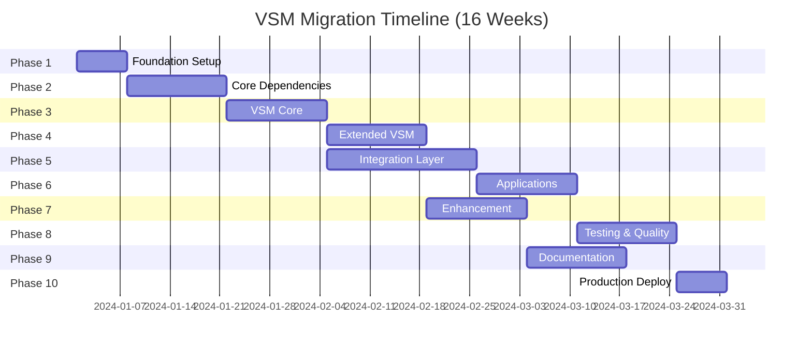

# VSM Migration Roadmap

This comprehensive roadmap guides the transformation from a monolithic system to a modular ecosystem of 31 repositories under the `@viable-systems` organization.

## Overview

The migration follows a carefully orchestrated 16-week plan, creating a production-ready VSM implementation with:

- **31 Total Repositories**
- **10 Migration Phases**
- **Zero-downtime transition**
- **Full backward compatibility**

## Repository Breakdown

-   :material-package-variant:{ .lg .middle } **13 Core Infrastructure**

    ---

    Essential VSM subsystems and support packages that form the foundation.

    [:octicons-arrow-right-24: View Core Packages](packages/core-infrastructure.md)

-   :material-cube-outline:{ .lg .middle } **5 Support Packages**

    ---

    Additional utilities and helpers for common VSM patterns.

    [:octicons-arrow-right-24: View Support Packages](packages/support-libraries.md)

-   :material-application:{ .lg .middle } **4 Main Applications**

    ---

    Complete applications built on the VSM framework.

    [:octicons-arrow-right-24: View Applications](packages/applications.md)

-   :material-book-multiple:{ .lg .middle } **5 Documentation Repos**

    ---

    Comprehensive documentation, examples, and learning resources.

    [:octicons-arrow-right-24: View Documentation](packages/documentation.md)

## Migration Phases

## Phase Overview

### [Phase 1: Foundation Setup](phases/phase-1.md) (Week 1)
Establish organizational infrastructure and core templates.

**Key Deliverables:**
- GitHub organization setup
- VSM starter template
- Documentation structure
- CI/CD templates

### [Phase 2: Core Dependencies](phases/phase-2.md) (Weeks 2-3)
Extract packages with zero VSM dependencies.

**Key Deliverables:**
- Telemetry infrastructure
- GoldRush event processing
- Rate limiting
- Configuration management

### [Phase 3: VSM Core](phases/phase-3.md) (Weeks 4-5)
Extract the heart of the VSM system.

**Key Deliverables:**
- All five subsystems (S1-S5)
- Algedonic Channel
- Temporal Variety Channel
- Core protocols

### [Phase 4: Extended VSM](phases/phase-4.md) (Weeks 6-7)
Add advanced VSM capabilities.

**Key Deliverables:**
- Z3N security architecture
- Advanced pattern recognition
- Distributed coordination
- Performance optimizations

### [Phase 5: Integration Layer](phases/phase-5.md) (Weeks 8-9)
Build bridges to external systems.

**Key Deliverables:**
- Phoenix integration
- GraphQL API
- REST endpoints
- Event streaming

### [Phase 6: Applications](phases/phase-6.md) (Weeks 10-11)
Deploy complete VSM applications.

**Key Deliverables:**
- VSM Console
- Monitoring dashboard
- API gateway
- Example applications

### [Phase 7: Enhancement](phases/phase-7.md) (Weeks 12-13)
Optimize and extend functionality.

**Key Deliverables:**
- Performance tuning
- Additional adapters
- Plugin system
- Advanced features

### [Phase 8: Testing & Quality](phases/phase-8.md) (Week 14)
Comprehensive testing and quality assurance.

**Key Deliverables:**
- Integration test suite
- Performance benchmarks
- Security audit
- Load testing

### [Phase 9: Documentation](phases/phase-9.md) (Week 15)
Complete documentation and learning resources.

**Key Deliverables:**
- API documentation
- Tutorial series
- Video guides
- Migration guides

### [Phase 10: Production Deployment](phases/phase-10.md) (Week 16)
Final production rollout.

**Key Deliverables:**
- Production deployment
- Monitoring setup
- Rollback procedures
- Success metrics

## Critical Path

The following packages are on the critical path and must be completed in order:

1. **vsm-starter** → Template for all other packages
2. **vsm-telemetry** → Observability for migration
3. **vsm-goldrush** → Event processing foundation
4. **vsm-core** → Core VSM implementation
5. **vsm-phoenix** → Web integration layer
6. **vsm-console** → Management interface

## Success Metrics

### Technical Metrics
- [ ] All 31 repositories created and published
- [ ] 100% test coverage on core packages
- [ ] < 100ms latency for inter-subsystem communication
- [ ] Zero-downtime migration completed

### Adoption Metrics
- [ ] 50+ stars on core repository
- [ ] 10+ external contributors
- [ ] 5+ production deployments
- [ ] Active community forum

### Quality Metrics
- [ ] All packages at version 1.0+
- [ ] Comprehensive documentation
- [ ] Video tutorial series
- [ ] Example applications

## Risk Mitigation

### Technical Risks
- **Circular Dependencies**: Careful package boundaries
- **Performance Regression**: Continuous benchmarking
- **API Breaking Changes**: Semantic versioning
- **Integration Issues**: Comprehensive testing

### Organizational Risks
- **Scope Creep**: Strict phase boundaries
- **Resource Constraints**: Prioritized backlog
- **Knowledge Silos**: Pair programming
- **Technical Debt**: Regular refactoring

## Next Steps

1. **Review the [detailed phase plans](phases/index.md)**
2. **Understand [package dependencies](packages/index.md)**
3. **Set up your [development environment](../getting-started/installation.md)**
4. **Join the [migration team](https://github.com/viable-systems/vsm-core/discussions)**

---

*"The best time to plant a tree was 20 years ago. The second best time is now."* - Chinese Proverb