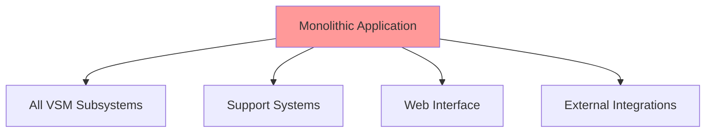
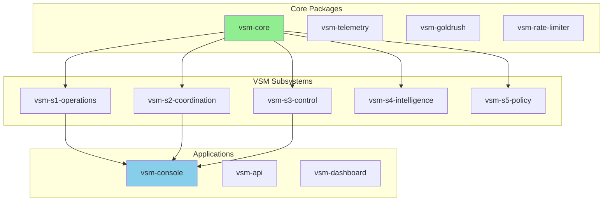

# Roadmap Overview

The VSM migration roadmap represents a comprehensive transformation from a monolithic architecture to a modular, scalable ecosystem. This overview provides the strategic context and key principles guiding the migration.

## Strategic Goals

### 1. **Modularity**
Transform the monolithic codebase into focused, reusable packages that can be:
- Independently versioned
- Separately deployed
- Community maintained
- Easily understood

### 2. **Scalability**
Enable systems to scale from single-node deployments to distributed clusters:
- Horizontal scaling of subsystems
- Location transparency
- Network partition tolerance
- Elastic resource allocation

### 3. **Maintainability**
Create a sustainable ecosystem for long-term development:
- Clear package boundaries
- Comprehensive documentation
- Automated testing
- Community governance

### 4. **Innovation**
Provide a platform for cybernetic research and development:
- Novel contributions (Temporal Variety Channel)
- Academic collaboration
- Real-world applications
- Open-source community

## Architecture Evolution

### Before: Monolithic Structure

### After: Modular Ecosystem

## Key Design Principles

### 1. **Dependency Inversion**
- Core packages have minimal dependencies
- Higher-level packages depend on abstractions
- Protocols define boundaries
- Implementations are pluggable

### 2. **Event-Driven Architecture**
- All state changes emit events
- Loose coupling between subsystems
- Event sourcing for audit trails
- CQRS for read/write optimization

### 3. **OTP Design Patterns**
- Supervision trees for fault tolerance
- GenServer for stateful components
- GenStage for backpressure
- Registry for service discovery

### 4. **Zero-Downtime Migration**
- Gradual rollout strategy
- Feature flags for transitions
- Backward compatibility
- Rollback procedures

## Package Categories

### Core Infrastructure (13 packages)
The foundation that everything builds upon:
- **vsm-core**: VSM subsystem implementations
- **vsm-telemetry**: Observability and metrics
- **vsm-goldrush**: Event processing engine
- **vsm-config**: Configuration management

### Support Libraries (5 packages)
Common utilities and patterns:
- **vsm-test**: Testing utilities
- **vsm-benchmark**: Performance testing
- **vsm-security**: Security primitives
- **vsm-math**: Mathematical operations

### Applications (4 packages)
Complete, deployable systems:
- **vsm-console**: Web-based management
- **vsm-api**: GraphQL/REST API server
- **vsm-dashboard**: Monitoring interface
- **vsm-gateway**: API gateway

### Documentation (5 repositories)
Learning and reference materials:
- **vsm-docs**: This documentation
- **vsm-examples**: Example implementations
- **vsm-tutorials**: Step-by-step guides
- **vsm-theory**: Academic papers

## Technology Stack

### Core Technologies
- **Elixir 1.15+**: Primary language
- **Erlang/OTP 25+**: Runtime platform
- **Phoenix 1.7+**: Web framework
- **PostgreSQL 14+**: Primary datastore
- **Redis**: Caching and pub/sub

### Development Tools
- **ExUnit**: Testing framework
- **Dialyzer**: Static analysis
- **Credo**: Code quality
- **ExDoc**: Documentation
- **Benchee**: Performance testing

### Infrastructure
- **Docker**: Containerization
- **Kubernetes**: Orchestration
- **Prometheus**: Monitoring
- **Grafana**: Visualization
- **GitHub Actions**: CI/CD

## Migration Approach

### 1. **Strangler Fig Pattern**
Gradually replace monolithic components:
1. Identify boundary
2. Extract interface
3. Implement separately
4. Route traffic
5. Remove old code

### 2. **Branch by Abstraction**
Create abstractions before extraction:
1. Define protocols
2. Implement for monolith
3. Create new implementation
4. Switch implementations
5. Remove old implementation

### 3. **Parallel Run**
Validate new implementations:
1. Run both systems
2. Compare outputs
3. Monitor performance
4. Gradual cutover
5. Decommission old

## Success Criteria

### Technical Success
- [ ] All tests passing
- [ ] Performance benchmarks met
- [ ] Zero data loss
- [ ] Backward compatibility maintained

### Business Success
- [ ] No service disruption
- [ ] Improved deployment velocity
- [ ] Reduced operational costs
- [ ] Enhanced developer productivity

### Community Success
- [ ] Active contributor base
- [ ] Regular releases
- [ ] Comprehensive documentation
- [ ] Vibrant ecosystem

## Timeline Overview

### Months 1-2: Foundation
- Organization setup
- Core infrastructure
- Basic VSM extraction

### Months 3-4: Expansion
- Extended subsystems
- Integration layers
- Application development

### Month 4: Finalization
- Testing and quality
- Documentation completion
- Production deployment

## Getting Involved

### For Contributors
1. Read the [contribution guide](../reference/contributing.md)
2. Check the [issue tracker](https://github.com/viable-systems/vsm-core/issues)
3. Join [discussions](https://github.com/viable-systems/vsm-core/discussions)
4. Submit pull requests

### For Users
1. Try the [starter template](https://github.com/viable-systems/vsm-starter)
2. Follow the [tutorials](../getting-started/index.md)
3. Deploy an [example application](../getting-started/examples.md)
4. Provide feedback

### For Organizations
1. Evaluate for your use case
2. Contact for support options
3. Consider sponsorship
4. Share success stories

---

*Next: [Phase 1 - Foundation Setup](phases/phase-1.md) →*