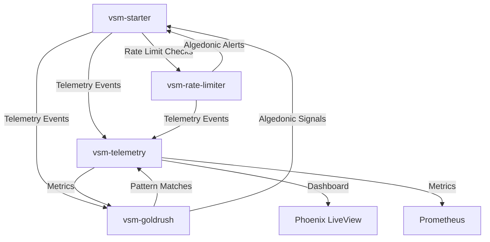

# VSM Packages

The Viable Systems ecosystem consists of several interconnected Elixir packages that implement cybernetic principles:

## Core Packages

### [vsm-starter](https://github.com/viable-systems/vsm-starter)
A starter template for building VSM applications:
- Template for S1-S5 subsystem structure
- Example channel implementations (Command, Resource, Audit, Algedonic)
- Standard telemetry event patterns
- Foundation for building VSM applications in Elixir

### [vsm-telemetry](https://github.com/viable-systems/vsm-telemetry) 
Advanced telemetry and monitoring for VSM systems:
- Real-time metrics collection from all subsystems
- Variety calculations and tracking
- Phoenix LiveView dashboards
- Prometheus metrics export
- WebSocket streaming of system state

### [vsm-goldrush](https://github.com/viable-systems/vsm-goldrush)
High-performance cybernetic pattern detection:
- Real-time detection of VSM failures (variety explosion, channel saturation)
- Native BEAM performance via goldrush compilation
- Temporal pattern detection (sequences, frequencies, correlations)
- GenStage integration for event streaming
- Pre-built cybernetic failure patterns

### [vsm-rate-limiter](https://github.com/viable-systems/vsm-rate-limiter)
VSM-aware rate limiting with variety attenuation:
- Implements Ashby's Law of Requisite Variety
- Subsystem-specific rate limits (S1-S5)
- Pluggable adapters (token bucket, ExRated, Hammer)
- Algedonic signaling for threshold breaches
- Dynamic variety attenuation based on system load

## Integration Architecture



## How They Work Together

1. **VSM Applications** (built using vsm-starter template) emit standard telemetry events for all subsystem activities

2. **vsm-telemetry** collects and aggregates these events into metrics, providing dashboards and monitoring

3. **vsm-goldrush** consumes telemetry events in real-time to detect cybernetic failures and patterns

### Example Integration Flow

```elixir
# 1. Your VSM app (built with vsm-starter) emits an event
:telemetry.execute(
  [:vsm, :system1, :operation, :error],
  %{count: 1, latency: 5000},
  %{error: :timeout}
)

# 2. vsm-telemetry collects it
# Updates metrics, dashboards, and forwards to collectors

# 3. vsm-goldrush detects patterns
# Checks if this is part of a cascade failure or variety explosion
# If pattern matches, triggers algedonic signal back to your VSM app
```

## Package Relationships

| Package | Type | Purpose | Integration |
|---------|------|---------|-------------|
| vsm-starter | Template | Foundation for building VSM apps | Provides patterns & structure |
| vsm-telemetry | Service | Monitoring & visualization | Consumes telemetry events |
| vsm-goldrush | Library | Real-time failure detection | Analyzes events for patterns |
| vsm-rate-limiter | Library | Variety attenuation & rate limiting | Protects subsystems from overload |

## Getting Started

To build a complete VSM system with monitoring and pattern detection:

1. **Create your VSM app** using vsm-starter as a template
2. **Add dependencies** for monitoring and analysis:

```elixir
# mix.exs in your VSM application
def deps do
  [
    # Core dependencies from vsm-starter template
    {:telemetry, "~> 1.2"},
    {:telemetry_metrics, "~> 1.0"},
    
    # Add VSM ecosystem packages
    {:vsm_telemetry, "~> 0.1.0"},     # For monitoring
    {:vsm_goldrush, "~> 0.1.0"},      # For pattern detection
    {:vsm_rate_limiter, "~> 0.1.0"}   # For variety attenuation
  ]
end
```

See individual package documentation for detailed integration examples.