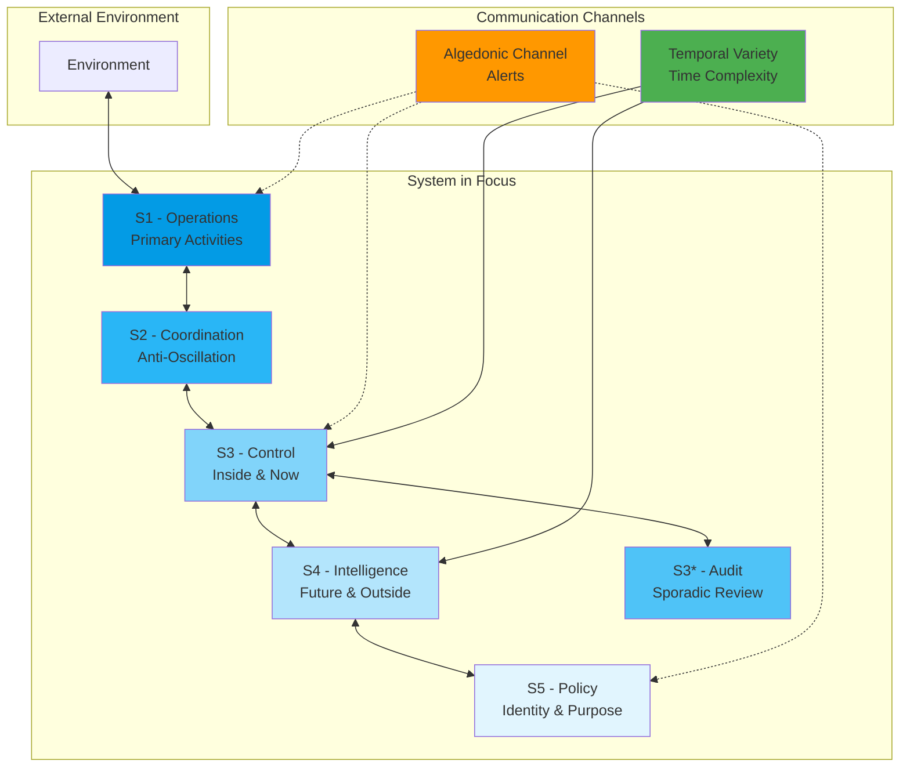

# VSM Subsystems

The Viable Systems Model consists of five interconnected subsystems, each with a specific role in maintaining system viability. Additionally, our implementation includes two critical communication channels: the Algedonic Channel and our innovative Temporal Variety Channel.

## Core Subsystems Overview



## The Five Subsystems

### [S1 - Operations](s1-operations/index.md)
The implementation level where the system's purpose is fulfilled. This is where actual work happens - products are made, services are delivered, or value is created.

**Key Features:**
- Autonomous operational units
- Direct environment interaction
- Local management capability
- Performance monitoring

### [S2 - Coordination](s2-coordination/index.md)
Prevents oscillation and conflict between operational units. Acts as the "sympathetic nervous system" ensuring smooth interaction between S1 units.

**Key Features:**
- Anti-oscillation mechanisms
- Resource conflict resolution
- Information harmonization
- Operational synchronization

### [S3 - Control](s3-control/index.md)
Day-to-day management of operations. Allocates resources, sets targets, and ensures operational units deliver their objectives. Includes S3* (audit) function.

**Key Features:**
- Resource bargaining
- Performance management
- Operational directives
- Audit and compliance (S3*)

### [S4 - Intelligence](s4-intelligence/index.md)
Looks outward and forward. Scans the environment for threats and opportunities, conducts research and development, and ensures adaptation.

**Key Features:**
- Environmental scanning
- Pattern recognition
- Strategic planning
- Innovation management

### [S5 - Policy](s5-policy/index.md)
Maintains system identity and purpose. Sets policy, resolves conflicts between S3 and S4, and represents the system to the wider environment.

**Key Features:**
- Identity maintenance
- Policy formulation
- Ultimate authority
- Ethos preservation

## Communication Channels

### [Algedonic Channel](algedonic/index.md)
A high-priority alerting system that bypasses normal communication channels. Like a nervous system's pain signals, it ensures critical information reaches decision-makers immediately.

**Key Features:**
- Bypasses hierarchy
- Priority signaling
- Automatic escalation
- Real-time alerts

### [Temporal Variety Channel](temporal-variety/index.md)
Our innovative contribution to VSM - handles complexity that varies over time. This 1,368-line subsystem addresses a gap in traditional VSM by managing temporal dynamics.

**Key Features:**
- Time-series analysis
- Predictive variety management
- Dynamic system tuning
- Historical pattern learning

## Implementation Architecture

Each subsystem in our Elixir implementation follows these patterns:

### Process Structure
```elixir
defmodule VSM.S1.Supervisor do
  use Supervisor
  
  def start_link(init_arg) do
    Supervisor.start_link(__MODULE__, init_arg, name: __MODULE__)
  end
  
  def init(_init_arg) do
    children = [
      {VSM.S1.Manager, []},
      {VSM.S1.Registry, []},
      {DynamicSupervisor, strategy: :one_for_one, name: VSM.S1.DynamicSupervisor}
    ]
    
    Supervisor.init(children, strategy: :one_for_all)
  end
end
```

### Message Flow
All subsystems communicate through well-defined protocols:

```elixir
defprotocol VSM.Message do
  @doc "Route a message through the VSM system"
  def route(message, context)
  
  @doc "Validate message format and permissions"
  def validate(message)
  
  @doc "Transform message for different subsystems"
  def transform(message, target_subsystem)
end
```

## Variety Engineering

A core concept throughout all subsystems is variety management:

- **Variety**: The number of possible states of a system
- **Requisite Variety**: Control variety must match environmental variety
- **Amplifiers**: Increase management variety (delegation, technology)
- **Attenuators**: Reduce environmental variety (standards, filters)

## Integration Points

### Phoenix LiveView
Each subsystem provides LiveView components for real-time monitoring:

```elixir
defmodule VSMWeb.S3.ControlPanelLive do
  use VSMWeb, :live_view
  
  def mount(_params, _session, socket) do
    if connected?(socket), do: VSM.S3.subscribe()
    
    {:ok, assign(socket, 
      resources: VSM.S3.list_resources(),
      allocations: VSM.S3.current_allocations()
    )}
  end
end
```

### Event Sourcing
All state changes are captured as events:

```elixir
defmodule VSM.Events.S4.PatternDetected do
  defstruct [:pattern_type, :confidence, :data, :timestamp, :subsystem]
  
  def new(pattern_type, confidence, data) do
    %__MODULE__{
      pattern_type: pattern_type,
      confidence: confidence,
      data: data,
      timestamp: DateTime.utc_now(),
      subsystem: :s4
    }
  end
end
```

## Best Practices

### 1. Subsystem Autonomy
Each subsystem should be able to operate independently while maintaining communication interfaces.

### 2. Clear Boundaries
Respect the separation of concerns between subsystems. S3 manages "inside and now", S4 handles "outside and future".

### 3. Event-Driven Communication
Use events for loose coupling between subsystems.

### 4. Monitoring First
Build comprehensive monitoring into each subsystem from the start.

### 5. Graceful Degradation
Design for partial system operation when subsystems fail.

## Next Steps

Explore each subsystem in detail:

1. Start with [S1 - Operations](s1-operations/index.md) to understand the foundation
2. Learn how [S2 - Coordination](s2-coordination/index.md) prevents conflicts
3. Discover [S3 - Control](s3-control/index.md) for resource management
4. Explore [S4 - Intelligence](s4-intelligence/index.md) for adaptation
5. Understand [S5 - Policy](s5-policy/index.md) for governance

Or dive into our communication channels:
- [Algedonic Channel](algedonic/index.md) for critical alerts
- [Temporal Variety Channel](temporal-variety/index.md) for time-based complexity

---

*"The purpose of a system is what it does."* - Stafford Beer